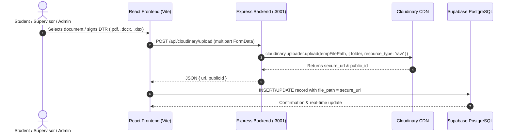

# Cloudinary Document Storage Integration Summary

**Date:** August 25–26, 2026  
**Project:** STI Marikina — Web-Based Practicum Management System with AI  
**Scope:** Integration of Cloudinary for Document, PDF, and Spreadsheet Blob Storage  

---

## 1. Executive Summary

During this session, we integrated **Cloudinary** as the primary cloud file storage provider for student submissions, supervisor-signed Daily Time Records (DTRs), and administrator document templates.

### Key Architecture Decisions:
- **Cloudinary for File Blobs**: All uploaded documents (`.pdf`, `.docx`, `.xlsx`) are stored directly on Cloudinary CDN under `resource_type: 'raw'`.
- **Supabase PostgreSQL for Metadata**: Document metadata (student name, course, status, urgency, AI findings, adviser feedback, timestamps) remains securely managed in Supabase PostgreSQL (`student_documents` and `template_metadata` tables).
- **Server-Side Security**: File uploads pass through the Express backend (`backend/routes/cloudinary.ts`) to ensure the Cloudinary API Secret is never exposed to the frontend browser.
- **Offline & Cache-First Resilience**: Admin templates retain local IndexedDB caching for instant in-browser previews and fallback resilience.

---

## 2. Environment & Credentials Configuration

The following environment variables were configured in [`.env`](file:///c:/Users/johnd/Downloads/MainCode/.env):

```env
# Cloudinary Credentials
CLOUDINARY_CLOUD_NAME="o3fze0oi"
CLOUDINARY_API_KEY="243797927425895"
CLOUDINARY_API_SECRET="ncK6KLAnN5JTMLxtHM-2NwCFtrg"
```

---

## 3. Architecture Overview & Data Flow



---

## 4. Summary of Code Changes

### A. Dependencies Added ([`package.json`](file:///c:/Users/johnd/Downloads/MainCode/package.json))
- `cloudinary` (`^2.5.0`): Server-side Cloudinary Node.js SDK.
- `multer` (`^1.4.5-lts.1`) & `@types/multer` (`^1.4.7`): Multipart/form-data middleware for file uploads.

### B. Backend Implementation
1. **[`backend/config/cloudinaryConfig.ts`](file:///c:/Users/johnd/Downloads/MainCode/backend/config/cloudinaryConfig.ts)** *(New)*:
   - Initialized `cloudinary.v2` using environment variables.
   - Ensures `dotenv.config()` is executed before configuration evaluation.

2. **[`backend/routes/cloudinary.ts`](file:///c:/Users/johnd/Downloads/MainCode/backend/routes/cloudinary.ts)** *(New)*:
   - `POST /api/cloudinary/upload`: Accepts file uploads, categorizes by folder (e.g. `practicum/submissions` or `practicum/templates`), supports custom or unique timestamped public IDs, preserves file extensions, and cleans up temporary local files upon completion.
   - `DELETE /api/cloudinary/delete`: Deletes assets from Cloudinary by `publicId`.
   - `GET /api/cloudinary/url`: Generates secure CDN URLs deterministically via the Cloudinary SDK.

3. **[`backend/server.ts`](file:///c:/Users/johnd/Downloads/MainCode/backend/server.ts)** *(Modified)*:
   - Mounted `cloudinaryRouter` under `/api` alongside the existing `/api/analyze` AI route.

### C. Frontend Storage Layer Migration
1. **[`src/lib/submissionStorage.ts`](file:///c:/Users/johnd/Downloads/MainCode/src/lib/submissionStorage.ts)** *(Modified)*:
   - `uploadSubmission()`: Routes document submissions (`.pdf`, `.docx`) through `/api/cloudinary/upload?folder=practicum/submissions` and persists the Cloudinary HTTPS URL in Supabase DB.
   - `publishSignedDTR()`: Converts supervisor-signed Excel timesheets (`.xlsx`) to a Blob, uploads to Cloudinary, and saves the CDN URL.
   - `getFileUrl()`: Returns direct Cloudinary URLs when `filePath.startsWith('http')`, preserving Supabase Storage compatibility for legacy entries.

2. **[`src/lib/templateStorage.ts`](file:///c:/Users/johnd/Downloads/MainCode/src/lib/templateStorage.ts)** *(Modified)*:
   - `saveTemplateFile()`: Uploads custom master templates (`.docx`, `.pdf`, `.xlsx`) to Cloudinary under `practicum/templates/` while keeping local IndexedDB for zero-latency preview caching.
   - `getTemplateFile()` & `getTemplatePdfBackup()`: Resolves files from IndexedDB cache first, then fetches from Cloudinary CDN URL, falling back to legacy Supabase Storage.
   - `deleteTemplate()`: Purges template files from Cloudinary, Supabase Storage, and IndexedDB simultaneously.

---

## 5. Verification & Testing

### Live Cloudinary API Verification
An end-to-end verification script was executed against the live Cloudinary servers:
1. **Authentication / Ping**: `cloudinary.api.ping()` returned `{ status: 'ok', rate_limit_allowed: 500 }`.
2. **Raw File Upload**: Test document uploaded to `practicum/test/`, returning a secure CDN URL (`https://res.cloudinary.com/o3fze0oi/raw/upload/...`).
3. **Asset Deletion**: `cloudinary.uploader.destroy()` successfully removed the test asset (`{ result: 'ok' }`).

### TypeScript Compilation & Linting
- Executed `npm run lint` (`tsc --noEmit`).
- **Result:** `0 errors` across both client and server codebases.

### Server Lifecycle Test
- Ran `npm run dev` concurrently:
  - **Frontend (Vite):** Running on `http://localhost:3000/`
  - **Backend (Express + Cloudinary + AI Review):** Running on `http://localhost:3001/`
