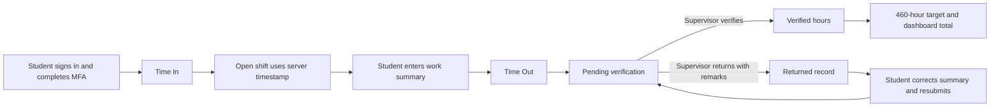

# Time In / Time Out and Attendance Verification

## Purpose

The attendance feature records a student's daily practicum shift using trusted server timestamps. A completed shift does not count toward the 460-hour practicum target until an authorized reviewer verifies it.

## Routes and roles

| Role | Sidebar page | Access |
| --- | --- | --- |
| Student | `/student/attendance` — **Time In / Out** | Start today's shift, end it with a work summary, correct returned records, and view personal history and target progress. |
| Supervisor | `/supervisor/attendance` — **Attendance Verification** | View only assigned interns, verify completed shifts, or return a shift with remarks. |
| Adviser | `/adviser/attendance` — **Attendance Monitor** | Read-only monitoring of assigned students and verified/pending hours. |
| Administrator | `/admin/attendance` — **Attendance Audit** | Institution-wide visibility and exception verification. |

Every route remains inside the existing role-protected portal layout. A user cannot open another role's route through direct URL entry.

## End-to-end flow



### Student rules

1. The account must be active, signed in, password-ready, and authenticated at AAL2/MFA.
2. A company supervisor must be assigned before a student can time in.
3. Only one attendance record is allowed per student per Philippine calendar date.
4. Time values come from the database server, not the browser clock.
5. Time out requires a 3–500 character work summary.
6. A shift must be at least one minute and cannot exceed 16 hours.
7. A 60-minute break is deducted when the elapsed shift is at least five hours.
8. Students cannot edit timestamps or directly mark records as verified.

### Verification rules

- The assigned supervisor can verify or return a pending record.
- Returning a record requires a 3–500 character explanation.
- An administrator may resolve exceptional records across the institution.
- Advisers have read-only monitoring access.
- A reviewer cannot access an unrelated student's record because access is checked by the database assignment policy.
- Verified records store the reviewer ID and verification timestamp.

## Target calculation

The progress component deliberately separates recorded hours from credited hours:

```text
verified minutes = sum(rendered_minutes where status = "verified")
target minutes   = 460 × 60
progress percent = min(100, verified minutes / target minutes × 100)
remaining        = max(target minutes - verified minutes, 0)
```

Open, pending, and returned records display in history but contribute **zero** to target progress. This prevents an unverified time-out from inflating the student's practicum completion.

## Record lifecycle

| Status | Meaning | Target impact | Next action |
| --- | --- | --- | --- |
| `open` | Student has timed in and has not timed out. | None | Student times out. |
| `pending` | Shift is complete and waiting for review. | None | Supervisor verifies or returns it. |
| `verified` | Reviewer accepted the shift. | Rendered minutes are credited. | Read-only audit/history. |
| `rejected` | Reviewer returned the record with remarks. | None | Student updates the work summary and resubmits. |

## Security and sign-in validation

The frontend never sends a student ID as the authority for a punch. `apiFetch()` attaches the current Supabase access token, and the attendance API validates all of the following before it performs an action:

- Supabase token belongs to a real user.
- Profile is active and activated.
- Session has not been revoked.
- Initial password change is complete.
- Authentication Assurance Level is `aal2`.
- Database profile role is allowed for the requested action.
- Student/reviewer assignment grants access to the target record.

Direct insert and update privileges on `attendance_records` are revoked. Security-definer database functions perform the allowed state transitions atomically and use `auth.uid()` as the actor identity.

## Implementation map

| Area | Location |
| --- | --- |
| Shared attendance page | `src/pages/shared/AttendancePage.tsx` |
| Attendance types and target helpers | `src/lib/attendance.ts` |
| Authenticated REST endpoints | `backend/routes/attendance.ts` |
| API router registration | `backend/server.ts` |
| Database schema, functions, RLS | `supabase/migrations/08_attendance_time_tracking.sql` |
| Role routes | `src/App.tsx` |
| Current application sidebar | `components/app-sidebar.tsx` |

## API surface

| Method | Endpoint | Allowed role | Purpose |
| --- | --- | --- | --- |
| `GET` | `/api/attendance?days=366` | All portal roles | Returns only records visible through RLS. |
| `POST` | `/api/attendance/time-in` | Student | Creates today's open shift using server time. |
| `POST` | `/api/attendance/time-out` | Student | Completes the open shift and queues it for review. |
| `POST` | `/api/attendance/:id/resubmit` | Student | Resubmits the student's returned record. |
| `PATCH` | `/api/attendance/:id/review` | Supervisor, administrator | Verifies or returns a pending shift. |

## Deployment requirement

Apply `08_attendance_time_tracking.sql` before exposing the sidebar links in production. The page intentionally fails closed when the migration or authentication checks are unavailable.
