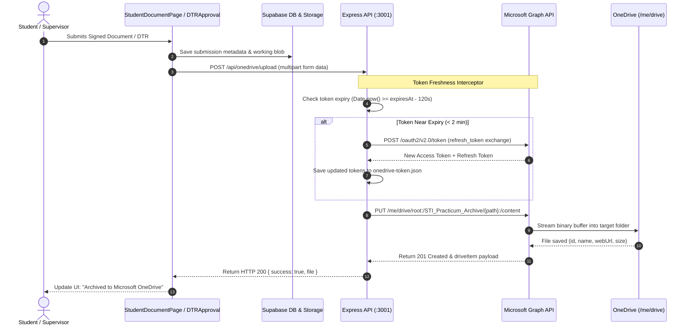

# Microsoft OneDrive Cloud Storage Integration Summary

[← Back to Documentation Hub](../README.md) | [Features Hub](../features/README.md) | [Auth & OneDrive Feature Guide](../features/08_AUTH_AND_ONEDRIVE_SYNC.md) | [Cloudinary Integration](CLOUDINARY_INTEGRATION_SUMMARY.md) | [Backend Architecture](BACKEND_AND_DATABASE.md)

**Date:** September 2026  
**Project:** STI College Marikina — Web-Based Practicum Management System with AI  
**Scope:** Integration of Microsoft OneDrive via Microsoft Graph API for Institutional Document Archival  

---

## 1. Executive Summary

> [!NOTE]
> **Current Status: Active & Operational**  
> Microsoft OneDrive is the active cloud backup and archival provider for the STI Practicum Portal. While active working previews are stored in Supabase Storage and client-side IndexedDB, all official approved student documents (application letters, notarized MOAs, parent consents, and supervisor-signed DTR spreadsheets) are automatically synced to Microsoft OneDrive via the Microsoft Graph API.

### Key Architectural Decisions

1. **Enterprise Institutional Compliance**: Preserves all practicum artifacts in official school cloud storage for CHED/DepEd compliance and accreditation audits.
2. **Server-to-Server Security**: Uploads pass through the Express backend (`backend/routes/onedrive.ts` and `backend/services/onedriveService.ts`) to ensure client secrets are never exposed in browser bundles.
3. **Automated Token Rotation**: An automated interceptor checks token freshness before every request, renewing access tokens 2 minutes prior to expiration without manual intervention.
4. **Hierarchical Auto-Filing**: Files are automatically organized into structured cohort directories (`Academic Year / Program & Section / Student Name / Milestone`).

---

## 2. Environment & Credentials Configuration

The following variables are configured in [`.env`](../../.env) and `.env.example`:

```env
# Microsoft Entra ID (Azure AD) & Microsoft Graph API
MICROSOFT_CLIENT_ID="your_azure_application_client_id"
MICROSOFT_CLIENT_SECRET="your_azure_client_secret_value"
MICROSOFT_TENANT_ID="common" # or "consumers" / specific tenant ID
ONEDRIVE_REDIRECT_URI="http://localhost:3001/api/onedrive/auth/callback"
```

> [!IMPORTANT]
> OAuth tokens are cached locally at `backend/config/onedrive-token.json`. This configuration file is strictly ignored in `.gitignore` to prevent leaking credentials to public git branches.

---

## 3. Architecture & Data Flow



---

## 4. Token Lifecycle & Expiration Protocol

| Token Type | Lifespan | Management Strategy | Failure Behavior |
| :--- | :--- | :--- | :--- |
| **Access Token** | **3,600 sec (1 hour)** | **Fully Automated**: Refreshed automatically by backend before every operation when remaining life is under 120 seconds. | Transparent to users; no interruption. |
| **Refresh Token** | **90 Days (Rolling Window)** | **Self-Renewing**: Every time the backend requests an access token, Microsoft extends the 90-day window. | Active usage extends validity indefinitely. |
| **Client Secret** | **180 Days to 2 Years** | **Semi-Annual Review**: Configured in Azure Portal under *Certificates & secrets*. | When expired, generate a new secret in Azure and update `.env`. |

### Re-Authentication (Idle System Recovery)

If the server remains idle for over 90 consecutive days (e.g. over summer vacation), simply perform a 1-click reconnect:

1. Open `http://localhost:3001/api/onedrive/auth/login` in your browser.
2. Sign in with the coordinator's Microsoft account and approve permissions.
3. Fresh tokens will be stored in `backend/config/onedrive-token.json` instantly. Existing files on OneDrive are never affected.

---

## 5. Storage Quotas & Limits

| Metric | Personal Free Account | Institutional M365 (STI) | Real-World Capacity |
| :--- | :--- | :--- | :--- |
| **Total Cloud Storage** | **5.0 GB** | **1.0 TB** (1,000 GB) | Holds **25,000 to 50,000+** PDF/DOCX letters (~100–200 KB per document). |
| **API Throttling Limit** | 10,000 calls / 10 min | 10,000 calls / 10 min | Handles peak submission deadlines without throttling. |
| **Single Upload Limit** | 4 MB per direct PUT | 4 MB per direct PUT | Easily covers standard letters, MOAs, and Excel DTR sheets. |
| **Upload Session Limit** | Up to 250 GB | Up to 250 GB | Available for large video portfolios or compiled semester archives. |

---

## 6. Structured Directory Hierarchy

All files synced to OneDrive follow this consistent, standardized folder schema:

```text
STI_Practicum_Archive/
└── Practicum_AY_2025_2026/
    └── BSIT_402/
        └── John_Dwayne_B._Guaniso/
            ├── Student_Application_Letter/
            │   └── John_Dwayne_B._Guaniso_Student_Application_Letter_17883581.pdf
            ├── Parent_Consent/
            │   └── John_Dwayne_B._Guaniso_Parent_Consent_17883592.pdf
            ├── Endorsement_Letter/
            │   └── John_Dwayne_B._Guaniso_Endorsement_Letter_17883604.pdf
            ├── MOA_Documents/
            │   └── John_Dwayne_B._Guaniso_MOA_Template_17883610.pdf
            └── Signed_DTR/
                └── DTR_March_2026_Signed.xlsx
```

---

## 7. Express API Endpoints Reference

The backend exposes these REST routes at `/api`:

| Method | Endpoint | Description | Query / Body Parameters |
| :--- | :--- | :--- | :--- |
| `GET` | `/api/onedrive/auth/login` | Starts OAuth2 authorization redirect with Microsoft Entra ID. | None |
| `GET` | `/api/onedrive/auth/callback` | OAuth2 callback handler; exchanges code for tokens. | `code`, `state` |
| `GET` | `/api/onedrive/status` | Reports connection state, account name, drive type, and remaining storage quota. | None |
| `POST` | `/api/onedrive/upload` | Uploads multipart file into OneDrive. | `file` (form-data), `folder` (query param) |
| `GET` | `/api/onedrive/files` | Lists files and folders within a designated subfolder. | `folder` (query param) |
| `GET` | `/api/onedrive/file/:id` | Fetches metadata and temporary direct download link for an item. | `id` (path param) |

---

## 8. Target Code Locator

| Module / Component | File Location | Purpose |
| :--- | :--- | :--- |
| **OneDrive Service** | [`backend/services/onedriveService.ts`](../../backend/services/onedriveService.ts) | Microsoft Graph API client, token refresh engine, upload stream handlers |
| **OneDrive Routes** | [`backend/routes/onedrive.ts`](../../backend/routes/onedrive.ts) | Express REST endpoints for OAuth, status, and file uploads |
| **Token Storage** | [`backend/config/onedrive-token.json`](../../backend/config/onedrive-token.json) | Local token cache (gitignored) |
| **Submission Storage** | [`src/lib/submissionStorage.ts`](../../src/lib/submissionStorage.ts) | Triggers OneDrive archival on student document submission |
| **Student UI** | [`src/components/compose/StudentDocumentPage.tsx`](../../src/components/compose/StudentDocumentPage.tsx) | Renders upload cards with live OneDrive cloud sync indicator |
| **Server Entry** | [`backend/server.ts`](../../backend/server.ts) | Mounts `/api/onedrive` router into the Express pipeline |

---

## 9. Step-by-Step Azure Setup Runbook

If you ever need to register a new application or reconfigure credentials:

1. **Azure for Students Registration**: Visit [azure.microsoft.com/free/students](https://azure.microsoft.com/free/students/) and verify with your `@marikina.sti.edu.ph` email ($0 cost, no credit card required).
2. **App Registration**: In [portal.azure.com](https://portal.azure.com/), create an app registration named `STI-Practicum-Portal` with **Multitenant and personal Microsoft accounts** selected.
3. **Client Secret**: Generate a client secret under *Certificates & secrets*, copy the value, and paste into `.env` under `MICROSOFT_CLIENT_SECRET`.
4. **API Permissions**: Add **Microsoft Graph** permissions: `Files.ReadWrite.All` and `offline_access`.
5. **Redirect URI**: Add a Web Redirect URI pointing to `http://localhost:3001/api/onedrive/auth/callback`.
6. **Initial Authentication**: Start the server (`npm run dev`) and visit `http://localhost:3001/api/onedrive/auth/login` to authorize.
