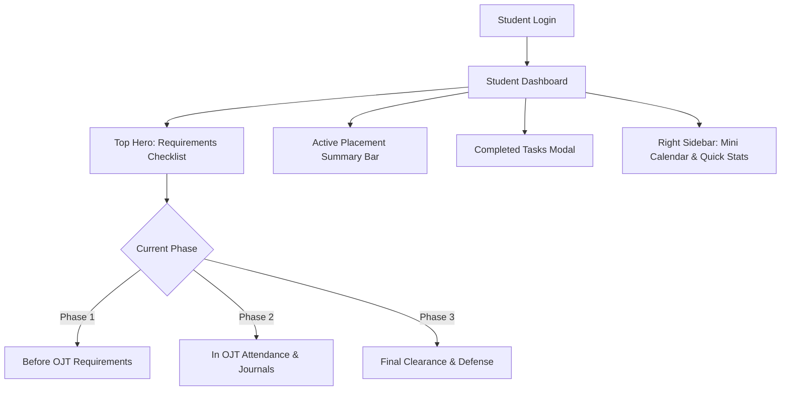
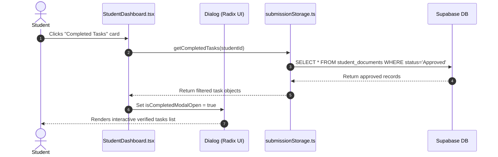

# 🎓 Student Portal & Practicum Checklist Documentation

[← Back to Features Hub](README.md) | [Documentation Hub](../README.md) | [Document Pipeline](02_DOCUMENT_PIPELINE.md) | [DTR Attendance](03_DTR_ATTENDANCE_SIGNATURE.md)

A complete functional and technical breakdown of the **Student Dashboard**, interactive requirement checklist, host company deployment card, and completed tasks modal.

---

## 🌟 Feature Overview

The Student Portal serves as the primary workspace for practicum students. It structures the student journey across three sequential phases:

1. **Before OJT**: Pre-internship requirements (Application Letter, Parent/Student Consent, MOA, Endorsement, Proposal).
2. **In OJT**: Active placement documentation (Daily Time Records, Weekly Journals, Training Plan).
3. **Finals**: Exit compliance (Integration Paper, Performance Appraisal, Final Clearance).



---

## 🏗️ Architecture & Dataflow

```text
┌─────────────────────────────────────────────────────────────────────────────┐
│                    STUDENT DASHBOARD DATAFLOW PIPELINE                      │
├─────────────────────────────────────────────────────────────────────────────┤
│                                                                             │
│   1. Mount Lifecycle:                                                       │
│      StudentDashboard.tsx ───► submissionStorage.ts (Supabase DB)           │
│                                ├─ Fetches active student profile            │
│                                ├─ Queries submitted documents for student   │
│                                └─ Calculates requirement phase completion % │
│                                                                             │
│   2. Requirement State Evaluation:                                          │
│      ┌────────────────────────┬──────────────────────┬──────────────────┐   │
│      │ Before OJT (8 items)   │ In OJT (3 items)     │ Finals (2 items) │   │
│      └────────────────────────┴──────────────────────┴──────────────────┘   │
│                 │                                                           │
│                 ▼                                                           │
│   3. Dynamic UI Render:                                                     │
│      • Segmented Phase Tabs (Active phase tab highlighted)                  │
│      • Stepper Timeline with current "Next Step" callout card               │
│      • Host Company Card (InnoTech Labs, supervisor, hours logged / 460)    │
│      • Completed Tasks Counter (Opens Radix Dialog on click)                │
│                                                                             │
└─────────────────────────────────────────────────────────────────────────────┘
```

---

## 🔍 How It Works Under the Hood

### 1. Unified 9-Column Main Layout and 3-Column Sidebar

The dashboard uses a standardized grid layout matching the supervisor and adviser portals:

- **Main Column (`lg:col-span-9`)**:
  - **Top Greeting & Header**: Displays a personalized greeting (`Hi John, welcome back! 👋`) with an interactive Completed Tasks card on the right.
  - **Requirements Checklist Card**: Replaced legacy carousel slides with an actionable multi-phase checklist card featuring segmented phase controls and connected stepper nodes.
  - **Placement Status Card**: Displays the active host training establishment (HTE), supervisor contact, total rendered hours counter (`122 / 460 Hours`), visual progress bar, and a direct button to log today's DTR.
- **Sidebar (`lg:col-span-3`)**:
  - Compact monthly mini-calendar widget.
  - Upcoming practicum deadlines and announcements feed.

---

### 2. Completed Tasks Modal Dialog

When students click the **Completed Tasks** card in the header, an accessible Radix `<Dialog>` opens:

- Aggregates all documents with status `Approved` or `Verified`.
- Displays verification timestamps and document phase badges.
- Provides one-click navigation to view each approved document directly.



---

## 🎯 Target Code Locator

| Entity / Logic | File Location | Purpose |
| :--- | :--- | :--- |
| **Main Page** | [`src/pages/student/StudentDashboard.tsx`](../../src/pages/student/StudentDashboard.tsx) | Primary student dashboard component |
| **Standard Page Wrapper** | [`src/components/compose/StudentDocumentPage.tsx`](../../src/components/compose/StudentDocumentPage.tsx) | Uniform wrapper for all 13 requirement pages |
| **Completed Tasks Dialog** | [`components/ui/dialog.tsx`](../../components/ui/dialog.tsx) | Radix UI modal primitive for verified items |
| **State & Persistence** | [`src/lib/submissionStorage.ts`](../../src/lib/submissionStorage.ts) | Reads/writes student submission records |

---

## 💡 Important Rules & Design Invariants

1. **Single Source of Truth**: Never mix hardcoded status arrays with live Supabase rows. Checklists must reflect the real status from `submissionStorage`.
2. **Phase Gating**: Students cannot advance to Final clearance documents until In OJT attendance requirements (460 hours) are verified by the supervisor.
3. **Responsive Sizing**: On mobile screens (`< 640px`), the 9/3 column grid collapses into a fluid single-column stack.

---

## Related Documentation & Cross-References

- [02. Digital Document Generation Pipeline](02_DOCUMENT_PIPELINE.md) — 13 institutional templates and DOCX generation
- [03. DTR Attendance & Signature Fitting](03_DTR_ATTENDANCE_SIGNATURE.md) — Daily Time Record and work hours calculation
- [05. Adviser & Supervisor Review Rooms](05_ADVISER_SUPERVISOR_REVIEW.md) — Review room and approval state transitions
- [Document Workflows Architecture](../architecture/DOCUMENT_WORKFLOWS.md) — Template inventory and `StudentDocumentPage` architecture
- [Active Tasks & Roadmap](../tasks/TASKS.md) — Student portal polish and task backlog
