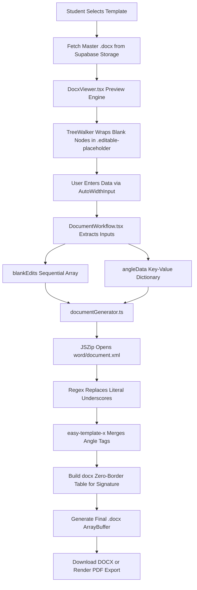

# 📄 Digital Document Generation Pipeline Documentation

A technical breakdown of the **interactive fill-in-the-blank document pipeline**, in-browser DOCX/PDF preview engines, `easy-template-x` tag interpolation, and programmatic signature block tables.

> 💡 **Executive Summary**: Replaces manual paperwork with 13 in-browser interactive fillable templates. Features live DOCX preview, sequential blank injection via JSZip, and custom delimiter merging with easy-template-x.

---

## 🌟 Feature Overview

The Document Pipeline allows students to fill official STI College Marikina practicum templates digitally inside their browser. It eliminates the need for manual printing, handwriting, and physical scanning.

### Master Template Inventory Across 3 Phases

1. **Before OJT Templates (8 Documents)**:
   * Student Application Letter
   * Parent Consent Form (With Fee)
   * Parent Consent Form (Without Fee)
   * Student Consent Form (With Fee)
   * Student Consent Form (Without Fee)
   * Memorandum of Agreement (MOA)
   * Endorsement Letter
   * Proposal Letter to Industry
2. **In OJT Templates (3 Documents)**:
   * Reflective Weekly Journal
   * Daily Time Record (DTR) Form
   * Host Company Training Plan Form
3. **Final Templates (2 Documents)**:
   * Practicum Integration Paper
   * Performance Appraisal Form

---

## 🏗️ Architecture & Generation Dataflow



---

## 🔍 How It Works Under the Hood

### 1. In-Browser DOCX Preview (`DocxViewer.tsx`)

When a student opens a document page, the raw `.docx` array buffer is rendered using `docx-preview`:

* **Container Constraint Overrides**: The library injects fixed widths (816px) that overflow responsive layouts. We apply strict parent CSS constraints:

  ```css
  [&_section]:!w-full [&_section]:!max-w-full [&_section]:!box-border
  ```

* **Header Suppression**: Immediately after `renderAsync` resolves, `<header>` elements are removed from the DOM so master template headers don't distort the fillable form.
* **Sequential Node Indexing**: A DOM `TreeWalker` finds all blank nodes using the regular expression:

  ```text
  /(\[.*?\]|_{3,}|<.*?>|^\s*Date\s*:?\s*$)/g
  ```

  It assigns sequential tracking attributes:
  * Literal blanks (`___`): `data-blank-index="0"`, `data-blank-index="1"`
  * Angle tags (`<TAG>`): `data-original="<SCHOOL NAME>"`
  * Date fields: `data-date-index="0"`

---

### 2. Form Field Input & Word Count Limiting (`AutoWidthInput.tsx`)

* **Offscreen Span Measurement**: An invisible `<span>` with identical typography dynamically measures the input text and sets the input's width pixel-for-pixel.
* **Print Engine Bug Protection**: Chrome's print engine truncates `<input size={1}>` to 1 character (~15px). In `@media print`, `<input>` elements are hidden and the offscreen `<span>` with `[data-print-text]` is rendered as visible text.
* **30-Word Safeguard**: `handleInputChange` enforces a strict 30-word limit per input to prevent student answers from distorting the formal layout of institutional letters.

---

### 3. Binary Generation & Tag Merging (`documentGenerator.ts`)

When the student clicks "Save & Generate Document":

1. **Static JSZip**: Opens the `.docx` archive and reads `word/document.xml`.
2. **Sequential Blank Injection**: Replaces `/_{3,}/g` matches in order with values from the `blankEdits` array.
3. **Angle Tag Replacement via `easy-template-x`**:
   Microsoft Word often splits tags like `<COMPANY NAME>` across multiple XML text runs. We use `easy-template-x` configured with custom delimiters to parse and merge these tags reliably:

   ```typescript
   const handler = new TemplateHandler({
     delimiters: { tagStart: "<", tagEnd: ">" }
   });
   const docBuffer = await handler.process(templateBuffer, angleData);
   ```

4. **Programmatic Signature Block Tables**:
   Signature lines must stay flush-left under "Respectfully yours," while the student's name remains centered under the line. We wrap the signature block in a zero-border `Table`:
   * Borders set to `BorderStyle.NONE` at the table level.
   * Cell width set to `2800 DXA` (matches 24 underscores).
   * Cell margins explicitly cleared: `{ left: 0, right: 0 }`.
   * Alignment set to `AlignmentType.CENTER` inside the cell.

---

## 🎯 Target Code Locator

| Component / Utility | File Location | Purpose |
| :--- | :--- | :--- |
| **Docx Preview Component** | [`src/components/compose/DocxViewer.tsx`](https://github.com/s5condlast-cmd/Capstone-2-Official-CloudHosting/blob/feature/landing-page-fixes/src/components/compose/DocxViewer.tsx) | Renders DOCX in DOM and indexes placeholders |
| **Dynamic Form Input** | [`src/components/compose/AutoWidthInput.tsx`](https://github.com/s5condlast-cmd/Capstone-2-Official-CloudHosting/blob/feature/landing-page-fixes/src/components/compose/AutoWidthInput.tsx) | Auto-expanding printable text input |
| **Document Workflow Wrapper** | [`src/components/compose/DocumentWorkflow.tsx`](https://github.com/s5condlast-cmd/Capstone-2-Official-CloudHosting/blob/feature/landing-page-fixes/src/components/compose/DocumentWorkflow.tsx) | Extracts inputs into sequential arrays and dictionaries |
| **Document Generator Engine** | [`src/utils/documentGenerator.ts`](https://github.com/s5condlast-cmd/Capstone-2-Official-CloudHosting/blob/feature/landing-page-fixes/src/utils/documentGenerator.ts) | JSZip + easy-template-x binary generation |

---

## 💡 Important Rules & Design Invariants

1. **Never use dynamic imports for JSZip**: Always use `import JSZip from 'jszip'` at the top of the file to prevent Vite dev server resolution errors.
2. **Read-Only Preview**: The `.editable-placeholder` spans in the preview must remain read-only (`pointer-events-none`). Form editing occurs through the interactive sidebar or overlay form controls.
3. **Unique State Keys**: Never share input state keys across distinct fields (e.g. `companyName` vs `salutationName`).
