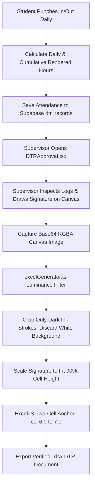

# ⏱️ DTR Attendance & Signature Fitting Documentation

A technical guide on the **Daily Time Record (DTR)** tracking system, work hour computation toward 460 hours, supervisor digital canvas signing, and Excel spreadsheet signature embedding.

---

## 🌟 Feature Overview

Practicum students must complete **460 hours** of on-site or hybrid industry training. This feature tracks:

1. **Daily Work Logs**: Morning IN/OUT, Afternoon IN/OUT, Overtime, and total daily rendered hours.
2. **Supervisor Inspection & Sign-off**: Host training supervisors review punch records and sign or stamp their signature.
3. **Official Excel Spreadsheet Export**: Generates `.xlsx` attendance reports with digital supervisor signatures fitted precisely into the sign-off cells.

---

## 🏗️ Architecture & Signature Dataflow



---

## 🔍 How It Works Under the Hood

### 1. Cumulative Hour Tracking (`DailyTimeRecord.tsx`)

* Automatically calculates daily work duration based on 4 punch timestamps:
  $$\text{Rendered Hours} = (\text{TimeOut}_{\text{AM}} - \text{TimeIn}_{\text{AM}}) + (\text{TimeOut}_{\text{PM}} - \text{TimeIn}_{\text{PM}})$$
* Enforces standard work shifts (typically 8 hours/day).
* Aggregates total completed hours against the 460-hour graduation requirement:
  $$\text{Progress \%} = \left(\frac{\text{Total Hours Logged}}{460}\right) \times 100$$

---

### 2. Supervisor Canvas Signature Capture (`SignatureCanvas.tsx`)

* Supervisors draw their signature using mouse or touchscreen inputs.
* Signatures can also be uploaded as transparent PNG images.
* Captured as a high-resolution data URI string (`data:image/png;base64,...`).

---

### 3. Dark Ink Luminance Filtering & Excel Cell Fitting (`excelGenerator.ts`)

Embedding raw signature drawings into Excel spreadsheets often causes alignment bugs due to extra whitespace or light gray canvas pixels. We apply a 5-step fitting protocol:

```text
┌─────────────────────────────────────────────────────────────────────────────┐
│                    EXCEL SIGNATURE FITTING PROTOCOL                         │
├─────────────────────────────────────────────────────────────────────────────┤
│                                                                             │
│  1. Physical Cell Dimensions:                                               │
│     Column G Width 30 = 225px, Row Height 45 = 60px (Ratio 3.75:1)         │
│                                                                             │
│  2. Dark Ink Luminance Filtering:                                           │
│     Scan RGBA array to ignore white pixels and find true stroke bounds:     │
│     isInk = alpha > 30 && (r < 200 || g < 200 || b < 200)                  │
│                                                                             │
│  3. Adaptive Scaling:                                                       │
│     Scale ink bounds to fill 90% of target cell height:                     │
│     targetH = Math.round(rowHeightPoints * 1.33 * 2)                        │
│                                                                             │
│  4. Strict 1:1 Cell Anchoring:                                              │
│     Span ExcelJS two-cell anchors strictly from integer boundary to boundary:│
│     tl: { col: 6.0, row: rowIndex - 1 }, br: { col: 7.0, row: rowIndex }    │
│                                                                             │
│  5. Zero Left Shift:                                                        │
│     Avoid fractional offsets (e.g. col: 6.2) that cause Excel to distort.   │
│                                                                             │
└─────────────────────────────────────────────────────────────────────────────┘
```

---

## 🎯 Target Code Locator

| Component / Utility | File Location | Purpose |
| :--- | :--- | :--- |
| **Student DTR Page** | [`src/pages/student/DailyTimeRecord.tsx`](https://github.com/s5condlast-cmd/Capstone-2-Official-CloudHosting/blob/feature/landing-page-fixes/src/pages/student/DailyTimeRecord.tsx) | Daily time entry, punch logs, progress tracker |
| **Supervisor Approval** | [`src/pages/supervisor/DTRApproval.tsx`](https://github.com/s5condlast-cmd/Capstone-2-Official-CloudHosting/blob/feature/landing-page-fixes/src/pages/supervisor/DTRApproval.tsx) | Supervisor inspection and signature canvas |
| **Canvas Signature Primitive** | [`src/components/review/SignatureCanvas.tsx`](https://github.com/s5condlast-cmd/Capstone-2-Official-CloudHosting/blob/feature/landing-page-fixes/src/components/review/SignatureCanvas.tsx) | Touch/mouse drawing component |
| **Excel Generation Engine** | [`src/utils/excelGenerator.ts`](https://github.com/s5condlast-cmd/Capstone-2-Official-CloudHosting/blob/feature/landing-page-fixes/src/utils/excelGenerator.ts) | ExcelJS workbook creation and signature fitting |

---

## 💡 Important Rules & Design Invariants

1. **Integer Column Anchors**: Always anchor column 6.0 to 7.0. Never use fractional numbers like 6.2.
2. **Strict Scope**: Luminance signature cropping must only be applied to DTR Approval (`DTRApproval.tsx`) and spreadsheet generation (`excelGenerator.ts`); do not alter other review pages like Weekly Journal Review.
3. **No Overwrite Without Approval**: Once signed by the supervisor, attendance rows are locked from student edits.
