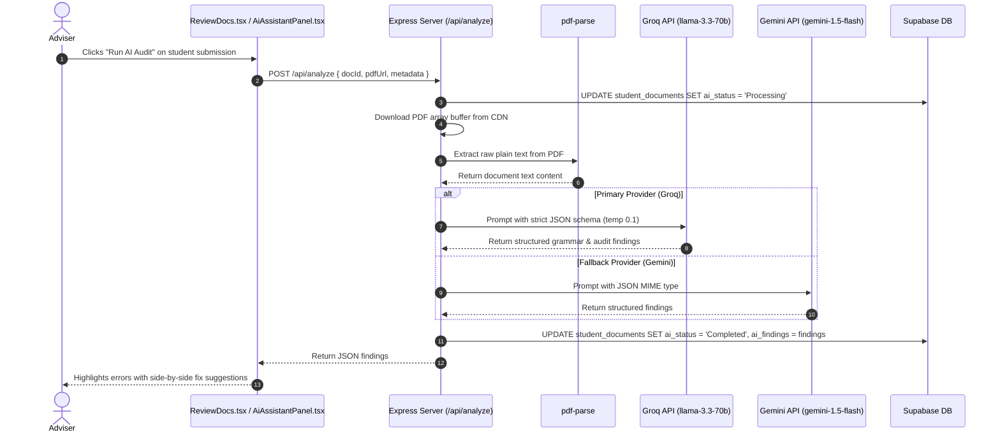

# 🤖 AI-Assisted Document & Grammar Review Documentation

[←  Back to Features Hub](README.md) | [Documentation Hub](../README.md) | [Adviser Review Rooms](05_ADVISER_SUPERVISOR_REVIEW.md) | [Backend Architecture](../architecture/BACKEND_AND_DATABASE.md)

A complete technical breakdown of the **AI Document Auditing Assistant**, backend text extraction pipeline, and dual-model LLM architecture (Groq + Gemini fallback).

---

## 🌟 Feature Overview

To assist practicum coordinators and faculty advisers in reviewing hundreds of student documents and weekly journals, the system features an automated AI compliance and grammar auditor:

1. **Grammar & Syntax Auditing**: Identifies grammatical errors, run-on sentences, awkward phrasing, and spelling issues with line-level context.
2. **Practicum Requirement Verification**: Checks whether required sections (e.g. Host company overview, student learnings, technical tasks performed) are present.
3. **Dual-Model Fallback Engine**: Uses ultra-fast Groq (`llama-3.3-70b-versatile`) as the primary evaluator, with seamless fallback to Google Gemini (`gemini-1.5-flash`).

---

## 🏗️ Architecture & AI Pipeline Dataflow



---

## 🔍 How It Works Under the Hood

### 1. Text Extraction (`pdf-parse`)

The backend receives the public CDN URL or raw buffer of the student's submission. It extracts the raw text layer without running client-side browser overhead:

```typescript
const pdfData = await pdfParse(pdfBuffer);
const documentText = pdfData.text;
```

---

### 2. Dual-Model Evaluation (`aiService.ts`)

- **Primary Engine: Groq (`llama-3.3-70b-versatile`)**:
  - Temperature: `0.1` (low temperature for deterministic, hallucination-free grammar checks).
  - Response Format: `json_object` enforcing structured feedback.
- **Secondary Fallback: Google Gemini (`gemini-1.5-flash`)**:
  - Activated automatically if Groq experiences API rate limits (HTTP 429), timeouts, or network outages.
  - Ensures 100% audit uptime for academic faculty.

---

### 3. Structured Audit Output Schema

The AI returns a normalized JSON object (`AiFindings` in `src/types/core.ts`) that the frontend renders into interactive assessment cards and checklists:

```json
{
  "overallAssessment": "Needs Attention",
  "grammarIssues": 2,
  "missingInformation": [
    "Signature line for host company supervisor is unverified",
    "Missing target completion date"
  ],
  "consistencyIssues": [
    "Company name in text (InnoTech Solutions) differs slightly from recorded partner (InnoTech Labs)"
  ],
  "recommendations": [
    "Clarify host company registered business name",
    "Ensure supervisor signature is applied before submitting for final clearance"
  ],
  "confidence": "High"
}
```

---

### 4. Interactive Review Panel (`AiAssistantPanel.tsx`)

- Displays overall assessment badge (`Good`, `Needs Attention`, `Critical Issues`), confidence level badge, and grammar error count metric.
- Renders itemized checklists of missing information and consistency discrepancies so advisers can review issues at a glance without reading through dense documents.
- Presents actionable recommendations that advisers can reference when drafting official feedback remarks.

---

## 🎯 Target Code Locator

| Entity / Logic | File Location | Purpose |
| :--- | :--- | :--- |
| **API Route** | [`backend/routes/analyze.ts`](../../backend/routes/analyze.ts) | Express route `POST /api/analyze` |
| **AI Service Provider** | [`backend/services/aiService.ts`](../../backend/services/aiService.ts) | Groq and Gemini SDK orchestrator |
| **Review Panel Component** | [`src/components/review/AiAssistantPanel.tsx`](../../src/components/review/AiAssistantPanel.tsx) | Interactive suggestion UI for faculty |
| **Adviser Review Page** | [`src/pages/adviser/ReviewDocs.tsx`](../../src/pages/adviser/ReviewDocs.tsx) | Split-view document inspection room |

---

## 💡 Important Rules & Design Invariants

1. **Non-Destructive**: The AI never alters the student's document automatically. It only provides advisory suggestions to the faculty member.
2. **Environment Variable Safeguards**: The backend gracefully checks for `VITE_GROQ_API_KEY` and `GEMINI_API_KEY`. If keys are missing, it returns a helpful diagnostic error instead of crashing.
3. **Database Audit Trail**: All audit findings are stored in Supabase under `student_documents.ai_findings` for historical review.

---

## Related Documentation & Cross-References

- [05. Adviser & Supervisor Review Rooms](05_ADVISER_SUPERVISOR_REVIEW.md) — Review room and audit interface
- [Backend, Database & AI Architecture](../architecture/BACKEND_AND_DATABASE.md) — Serverless AI routes and table schemas
- [System Architecture Overview](../architecture/ARCHITECTURE.md) — High-level architecture and API services
- [System Map & Code Locator](../architecture/SYSTEM_MAP.md) — Problem-fix register and direct routes
