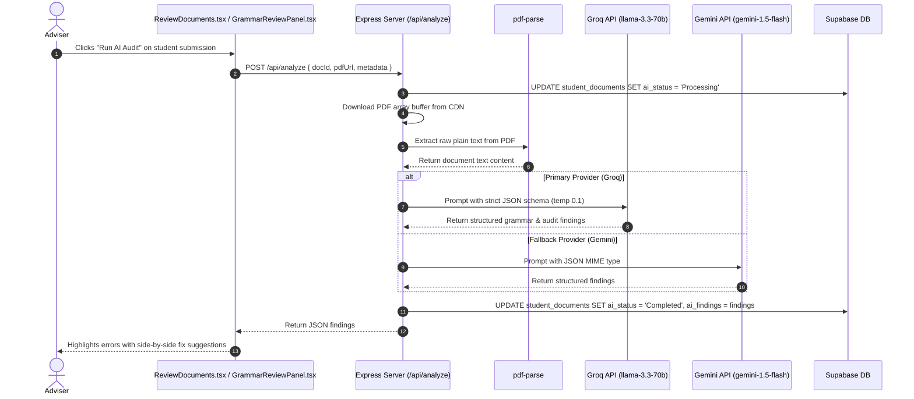

# 🤖 AI-Assisted Document & Grammar Review Documentation

A complete technical breakdown of the **AI Document Auditing Assistant**, backend text extraction pipeline, and dual-model LLM architecture (Groq + Gemini fallback).

> 💡 **Executive Summary**: AI-powered advisory assistant for coordinators. Automatically extracts PDF text on the backend and runs deterministic grammar and compliance audits using Groq Llama-3.3 with Gemini fallback.

---

## 🌟 Feature Overview

To assist practicum coordinators and faculty advisers in reviewing hundreds of student documents and weekly journals, the system features an automated AI compliance and grammar auditor:

1. **Grammar & Syntax Auditing**: Identifies grammatical errors, run-on sentences, awkward phrasing, and spelling issues with line-level context.
2. **Practicum Requirement Verification**: Checks whether required sections (e.g. Host company overview, student learnings, technical tasks performed) are present.
3. **Dual-Model Fallback Engine**: Uses ultra-fast Groq (`llama-3.3-70b-versatile`) as the primary evaluator, with seamless fallback to Google Gemini (`gemini-1.5-flash`).

---

## 🏗️ Architecture & AI Pipeline Dataflow



---

## 🔍 How It Works Under the Hood

### 1. Text Extraction (`pdf-parse`)

The backend receives the public CDN URL or raw buffer of the student's submission. It extracts the raw text layer without running client-side browser overhead:

```typescript
const pdfData = await pdfParse(pdfBuffer);
const documentText = pdfData.text;
```

---

### 2. Dual-Model Evaluation (`aiService.ts`)

* **Primary Engine: Groq (`llama-3.3-70b-versatile`)**:
  * Temperature: `0.1` (low temperature for deterministic, hallucination-free grammar checks).
  * Response Format: `json_object` enforcing structured feedback.
* **Secondary Fallback: Google Gemini (`gemini-1.5-flash`)**:
  * Activated automatically if Groq experiences API rate limits (HTTP 429), timeouts, or network outages.
  * Ensures 100% audit uptime for academic faculty.

---

### 3. Structured Audit Output Schema

The AI returns a normalized JSON object that the frontend renders into interactive suggestion pills:

```json
{
  "overallScore": 88,
  "complianceStatus": "Satisfactory",
  "grammarIssues": [
    {
      "originalText": "We was assigned to configure the router.",
      "suggestedText": "We were assigned to configure the router.",
      "explanation": "Subject-verb agreement error with plural pronoun 'We'.",
      "severity": "High"
    }
  ],
  "missingSections": [],
  "adviserRecommendation": "Approve with minor grammatical revisions."
}
```

---

### 4. Interactive Review Panel (`GrammarReviewPanel.tsx`)

* Displays side-by-side comparisons of the original student text and recommended fixes.
* Advisers can click **"Apply Suggestion"** to insert the feedback directly into the adviser remarks comment box.

---

## 🎯 Target Code Locator

| Entity / Logic | File Location | Purpose |
| :--- | :--- | :--- |
| **API Route** | [`backend/routes/analyze.ts`](https://github.com/s5condlast-cmd/Capstone-2-Official-CloudHosting/blob/feature/landing-page-fixes/backend/routes/analyze.ts) | Express route `POST /api/analyze` |
| **AI Service Provider** | [`backend/services/aiService.ts`](https://github.com/s5condlast-cmd/Capstone-2-Official-CloudHosting/blob/feature/landing-page-fixes/backend/services/aiService.ts) | Groq and Gemini SDK orchestrator |
| **Review Panel Component** | [`src/components/review/GrammarReviewPanel.tsx`](https://github.com/s5condlast-cmd/Capstone-2-Official-CloudHosting/blob/feature/landing-page-fixes/src/components/review/GrammarReviewPanel.tsx) | Interactive suggestion UI for faculty |
| **Adviser Review Page** | [`src/pages/adviser/ReviewDocuments.tsx`](https://github.com/s5condlast-cmd/Capstone-2-Official-CloudHosting/blob/feature/landing-page-fixes/src/pages/adviser/ReviewDocuments.tsx) | Split-view document inspection room |

---

## 💡 Important Rules & Design Invariants

1. **Non-Destructive**: The AI never alters the student's document automatically. It only provides advisory suggestions to the faculty member.
2. **Environment Variable Safeguards**: The backend gracefully checks for `VITE_GROQ_API_KEY` and `GEMINI_API_KEY`. If keys are missing, it returns a helpful diagnostic error instead of crashing.
3. **Database Audit Trail**: All audit findings are stored in Supabase under `student_documents.ai_findings` for historical review.
