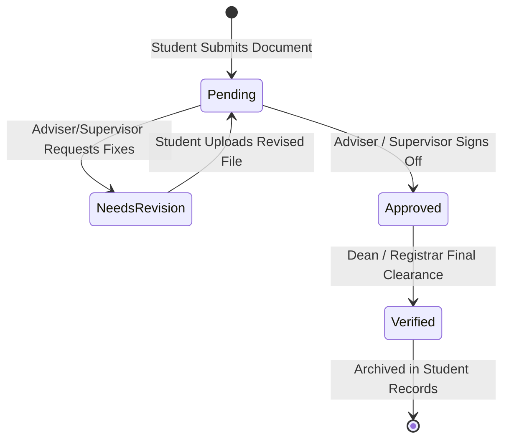

---
title: "Adviser & Supervisor Review Rooms Documentation"
description: "Faculty Adviser and Industry Supervisor Review Workflows, dual-viewport document inspection, revision cycles, and official sign-offs."
tags:
  - sti-ojt
  - adviser-portal
  - supervisor-portal
  - document-review
  - approvals
  - review-room
aliases:
  - "Adviser Review Rooms"
  - "Supervisor Review"
  - "Review Documents"
created: 2026-08-26
updated: 2026-09-04
---

# 👥 Adviser & Supervisor Review Rooms Documentation

[←  Back to Features Hub](README.md) | [Documentation Hub](../README.md) | [AI Grammar Audit](04_AI_GRAMMAR_AUDIT.md) | [DTR Attendance](03_DTR_ATTENDANCE_SIGNATURE.md) | [Document Workflows Spec](../architecture/DOCUMENT_WORKFLOWS.md)

A comprehensive guide on the **Faculty Adviser and Industry Supervisor Review Workflows**, dual-viewport document inspection, revision cycles, and official sign-offs.

---

## 🌟 Feature Overview

The review workflows give academic coordinators and company supervisors dedicated portals to verify student submissions:

1. **Dual-Viewport Inspection**: View the student's submitted document (PDF, DOCX, XLSX) on the left while checking criteria and writing remarks on the right.
2. **Four-State Submission Lifecycle**: Structured status transitions (`Pending` $\rightarrow$ `Needs Revision` $\rightarrow$ `Approved` $\rightarrow$ `Verified`).
3. **Historical Comments Thread**: Preserves an append-only audit trail of adviser feedback, timestamps, and student revision notes.

---

## 🏗️ State Machine & Review Dataflow



---

## 🔍 How It Works Under the Hood

### 1. Dual-Viewport Layout (`ReviewDocuments.tsx`)

To avoid opening external PDF viewers or downloading files to the desktop:

- **Left Viewport (`col-span-7` or `col-span-8`)**:
  - Renders native PDF submissions with `@embedpdf/react-pdf-viewer`.
  - Renders DOCX submissions with `DocxViewer.tsx`.
  - Supports zoom, page navigation, and text search.
- **Right Viewport (`col-span-5` or `col-span-4`)**:
  - Displays the student's submission metadata (submission timestamp, student number, section).
  - Hosts the **AI Grammar Audit Panel** with one-click suggestion insertion.
  - Contains the feedback input box and action buttons:
    - **Request Revision** (destructive/amber style)
    - **Approve Document** (emerald/success style)

---

### 2. Multi-Role Permissions & Responsibilities

```text
┌─────────────────────────────────────────────────────────────────────────────┐
│                          REVIEW WORKFLOW BY ROLE                            │
├───────────────────────┬─────────────────────────┬───────────────────────────┤
│ User Role             │ Supervised Scope        │ Key Decision Documents    │
├───────────────────────┼─────────────────────────┼───────────────────────────┤
│ Academic Adviser      │ Entire student section  │ ”¢ Application Letter      │
│                       │ (40–50 students)        │ ”¢ Consent Forms           │
│                       │                         │ ”¢ Industry MOA            │
│                       │                         │ ”¢ Proposal Letter         │
│                       │                         │ ”¢ Endorsement Letter      │
├───────────────────────┼─────────────────────────┼───────────────────────────┤
│ Company Supervisor    │ Host company interns    │ ”¢ Daily Time Records (DTR)│
│                       │ (1–5 students)          │ ”¢ Weekly Journals         │
│                       │                         │ ”¢ Training Plan Form      │
│                       │                         │ ”¢ Performance Appraisal   │
│                       │                         │ ”¢ Certificate of Complete │
├───────────────────────┼─────────────────────────┼───────────────────────────┤
│ Admin / Registrar     │ Entire institution      │ ”¢ Final Practicum Clearance│
│                       │ (All programs)          │ ”¢ Grade Endorsement       │
└───────────────────────┴─────────────────────────┴───────────────────────────┘
```

---

### 3. Dynamic Submission History Syncing

When a faculty member selects a student from the review queue:

1. The component queries `submissionStorage` for the active submission ID.
2. It fetches the document file buffer from Cloudinary or Supabase Storage.
3. It loads the `comments` array and maps prior revision logs sequentially:

   ```typescript
   interface SubmissionComment {
     id: string;
     authorName: string;
     authorRole: 'adviser' | 'supervisor' | 'student';
     text: string;
     createdAt: string;
   }
   ```

4. Clicking **"Approve"** updates `status = 'Approved'`, adds a system comment, and sends a notification alert to the student's dashboard.

---

## 🎯 Target Code Locator

| Component / Utility | File Location | Purpose |
| :--- | :--- | :--- |
| **Adviser Review Room** | [`src/pages/adviser/ReviewDocs.tsx`](../../src/pages/adviser/ReviewDocs.tsx) | Side-by-side document review room |
| **Adviser Sign-offs** | [`src/pages/adviser/Approvals.tsx`](../../src/pages/adviser/Approvals.tsx) | Batch approval and clearance actions |
| **Supervisor Journal Review** | [`src/pages/supervisor/WeeklyJournalReview.tsx`](../../src/pages/supervisor/WeeklyJournalReview.tsx) | Supervisor weekly journal rating & comments |
| **Supervisor DTR Approval** | [`src/pages/supervisor/DTRApproval.tsx`](../../src/pages/supervisor/DTRApproval.tsx) | Supervisor attendance review & signature stamping |
| **Preview Workspace** | [`src/components/review/EmbedPdfWorkspace.tsx`](../../src/components/review/EmbedPdfWorkspace.tsx) | Fullscreen document preview workspace |

---

## 💡 Important Rules & Design Invariants

1. **Localized Loading Indicators**: Do not reload the entire page skeleton when clicking Approve or Request Revision; show a localized spinner on the action button itself.
2. **Mandatory Revision Reason**: The system strictly forbids marking a submission as `Needs Revision` without providing at least 10 characters of explanatory feedback.
3. **Empty States**: If a review queue has zero pending submissions, always render the standard `EmptyState.tsx` component with clear messaging.

---

## Related Documentation & Cross-References

- [01. Student Portal & Checklist](01_STUDENT_PORTAL_CHECKLIST.md) — Student requirement submission lifecycle
- [03. DTR Attendance & Signature Fitting](03_DTR_ATTENDANCE_SIGNATURE.md) — Supervisor DTR signing and Excel fitting
- [04. AI-Assisted Document Audit](04_AI_GRAMMAR_AUDIT.md) — Grammar checks and automated compliance feedback
- [Document Workflows Architecture](../architecture/DOCUMENT_WORKFLOWS.md) — Template inventory and review models
- [Backend & Database Architecture](../architecture/BACKEND_AND_DATABASE.md) — `student_documents` table and status fields
