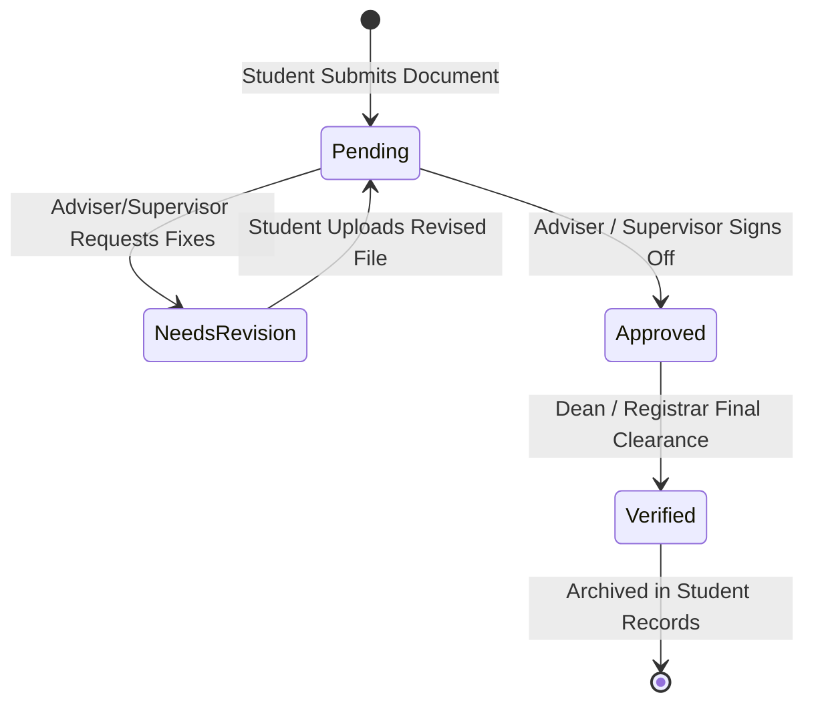

# 👥 Adviser & Supervisor Review Rooms Documentation

A comprehensive guide on the **Faculty Adviser and Industry Supervisor Review Workflows**, dual-viewport document inspection, revision cycles, and official sign-offs.

---

## 🌟 Feature Overview

The review workflows give academic coordinators and company supervisors dedicated portals to verify student submissions:

1. **Dual-Viewport Inspection**: View the student's submitted document (PDF, DOCX, XLSX) on the left while checking criteria and writing remarks on the right.
2. **Four-State Submission Lifecycle**: Structured status transitions (`Pending` $\rightarrow$ `Needs Revision` $\rightarrow$ `Approved` $\rightarrow$ `Verified`).
3. **Historical Comments Thread**: Preserves an append-only audit trail of adviser feedback, timestamps, and student revision notes.

---

## 🏗️ State Machine & Review Dataflow



---

## 🔍 How It Works Under the Hood

### 1. Dual-Viewport Layout (`ReviewDocuments.tsx`)

To avoid opening external PDF viewers or downloading files to the desktop:

* **Left Viewport (`col-span-7` or `col-span-8`)**:
  * Renders native PDF submissions with `@embedpdf/react-pdf-viewer`.
  * Renders DOCX submissions with `DocxViewer.tsx`.
  * Supports zoom, page navigation, and text search.
* **Right Viewport (`col-span-5` or `col-span-4`)**:
  * Displays the student's submission metadata (submission timestamp, student number, section).
  * Hosts the **AI Grammar Audit Panel** with one-click suggestion insertion.
  * Contains the feedback input box and action buttons:
    * **Request Revision** (destructive/amber style)
    * **Approve Document** (emerald/success style)

---

### 2. Multi-Role Permissions & Responsibilities

```text
┌─────────────────────────────────────────────────────────────────────────────┐
│                          REVIEW WORKFLOW BY ROLE                            │
├───────────────────────┬─────────────────────────┬───────────────────────────┤
│ User Role             │ Supervised Scope        │ Key Decision Documents    │
├───────────────────────┼─────────────────────────┼───────────────────────────┤
│ Academic Adviser      │ Entire student section  │ • Application Letter      │
│                       │ (40–50 students)        │ • Consent Forms           │
│                       │                         │ • Industry MOA            │
│                       │                         │ • Proposal Letter         │
│                       │                         │ • Endorsement Letter      │
├───────────────────────┼─────────────────────────┼───────────────────────────┤
│ Company Supervisor    │ Host company interns    │ • Daily Time Records (DTR)│
│                       │ (1–5 students)          │ • Weekly Journals         │
│                       │                         │ • Training Plan Form      │
│                       │                         │ • Performance Appraisal   │
│                       │                         │ • Certificate of Complete │
├───────────────────────┼─────────────────────────┼───────────────────────────┤
│ Admin / Registrar     │ Entire institution      │ • Final Practicum Clearance│
│                       │ (All programs)          │ • Grade Endorsement       │
└───────────────────────┴─────────────────────────┴───────────────────────────┘
```

---

### 3. Dynamic Submission History Syncing

When a faculty member selects a student from the review queue:

1. The component queries `submissionStorage` for the active submission ID.
2. It fetches the document file buffer from Cloudinary or Supabase Storage.
3. It loads the `comments` array and maps prior revision logs sequentially:
   ```typescript
   interface SubmissionComment {
     id: string;
     authorName: string;
     authorRole: 'adviser' | 'supervisor' | 'student';
     text: string;
     createdAt: string;
   }
   ```
4. Clicking **"Approve"** updates `status = 'Approved'`, adds a system comment, and sends a notification alert to the student's dashboard.

---

## 🎯 Target Code Locator

| Component / Utility | File Location | Purpose |
| :--- | :--- | :--- |
| **Adviser Review Room** | [`src/pages/adviser/ReviewDocuments.tsx`](file:///c:/Users/johnd/Downloads/MainCode/src/pages/adviser/ReviewDocuments.tsx) | Side-by-side document review room |
| **Adviser Sign-offs** | [`src/pages/adviser/Approvals.tsx`](file:///c:/Users/johnd/Downloads/MainCode/src/pages/adviser/Approvals.tsx) | Batch approval and clearance actions |
| **Supervisor Journal Review** | [`src/pages/supervisor/WeeklyJournalReview.tsx`](file:///c:/Users/johnd/Downloads/MainCode/src/pages/supervisor/WeeklyJournalReview.tsx) | Supervisor weekly journal rating & comments |
| **Supervisor DTR Approval** | [`src/pages/supervisor/DTRApproval.tsx`](file:///c:/Users/johnd/Downloads/MainCode/src/pages/supervisor/DTRApproval.tsx) | Supervisor attendance review & signature stamping |
| **Preview Modal** | [`src/components/review/DocumentPreviewModal.tsx`](file:///c:/Users/johnd/Downloads/MainCode/src/components/review/DocumentPreviewModal.tsx) | Fullscreen document preview dialog |

---

## 💡 Important Rules & Design Invariants

1. **Localized Loading Indicators**: Do not reload the entire page skeleton when clicking Approve or Request Revision; show a localized spinner on the action button itself.
2. **Mandatory Revision Reason**: The system strictly forbids marking a submission as `Needs Revision` without providing at least 10 characters of explanatory feedback.
3. **Empty States**: If a review queue has zero pending submissions, always render the standard `EmptyState.tsx` component with clear messaging.

