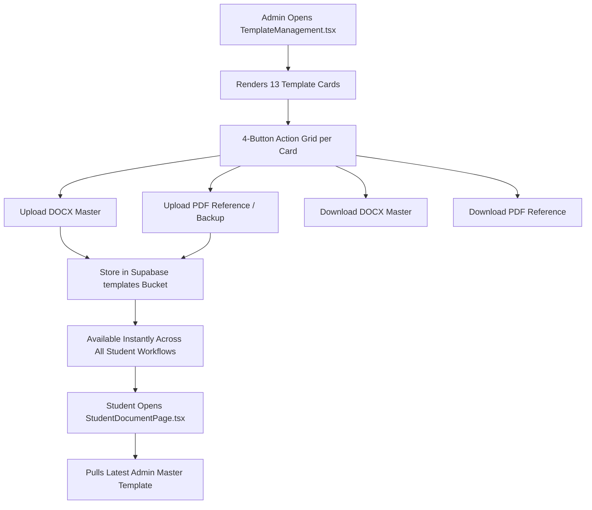

# ⚙️ Admin Master Templates & Clearance Verification Documentation

A complete technical breakdown of the **Administrator Console**, master template distribution system, uniform 4-button action grid, and institutional clearance verification.

---

## 🌟 Feature Overview

The Administrator Console provides school administrators, program heads, and registrars with global oversight of the practicum system:

1. **Master Template Management**: Upload, replace, and distribute the 13 official master DOCX files and their companion PDF references.
2. **Clearance & Verification Queue**: Final stage gate where registrars verify that all practicum hours (460h) and documents are satisfied before clearing students for graduation.
3. **User & Partner Administration**: Manage student rosters, faculty adviser assignments, and host training establishment (HTE) partnerships.

---

## 🏗️ Architecture & Template Distribution Dataflow



---

## 🔍 How It Works Under the Hood

### 1. The Uniform 4-Button Action Grid

To eliminate hidden actions, ambiguous menus, and inconsistent card layouts, every template card in [`TemplateManagement.tsx`](file:///c:/Users/johnd/Downloads/MainCode/src/pages/admin/TemplateManagement.tsx) exposes an identical 4-button action grid:

```text
┌─────────────────────────────────────────────────────────────────────────────┐
│                       MASTER TEMPLATE CARD ACTION GRID                      │
├─────────────────────────────────────────────────────────────────────────────┤
│                                                                             │
│  [Template Title: Student Application Letter]                               │
│  Phase: Before OJT   |   File Type: DOCX + PDF Reference   |  Status: Active│
│                                                                             │
│  ┌───────────────────────────────┬───────────────────────────────┐          │
│  │   ⬆ Upload DOCX (Primary)     │   ⬆ Upload PDF (Primary)      │          │
│  ├───────────────────────────────┼───────────────────────────────┤          │
│  │   ⬇ Download DOCX (Outline)   │   ⬇ Download PDF (Outline)    │          │
│  └───────────────────────────────┴───────────────────────────────┘          │
│                                                                             │
└─────────────────────────────────────────────────────────────────────────────┘
```

* **Upload DOCX**: Replaces the master document used by `documentGenerator.ts` to generate student submissions.
* **Upload PDF Backup**: Serves as a reference layout and provides an automatic fallback download if the student's browser cannot render dynamic DOCX previews.
* **Download DOCX**: Allows coordinators to download the raw master document for off-platform edits.
* **Download PDF**: Allows students and faculty to view or print the blank official document directly.

---

### 2. Institutional Document Verification (`DocumentVerification.tsx`)

The final institutional gate before a student receives academic practicum credit:

* Aggregates completed student profiles with all 3 phases marked `Approved`.
* Displays verified total attendance hours (verified by the supervisor).
* Allows registrars to issue the **Final Practicum Clearance Stamp**.
* Automatically generates a completion record and archives the student's documentation.

---

## 🎯 Target Code Locator

| Component / Utility | File Location | Purpose |
| :--- | :--- | :--- |
| **Admin Dashboard** | [`src/pages/admin/AdminDashboard.tsx`](file:///c:/Users/johnd/Downloads/MainCode/src/pages/admin/AdminDashboard.tsx) | System statistics, active student counts, charts |
| **Template Management** | [`src/pages/admin/TemplateManagement.tsx`](file:///c:/Users/johnd/Downloads/MainCode/src/pages/admin/TemplateManagement.tsx) | Master template uploads and 4-button action grid |
| **Document Verification** | [`src/pages/admin/DocumentVerification.tsx`](file:///c:/Users/johnd/Downloads/MainCode/src/pages/admin/DocumentVerification.tsx) | Registrar final clearance and graduation sign-off |
| **User Management** | [`src/pages/admin/UserManagement.tsx`](file:///c:/Users/johnd/Downloads/MainCode/src/pages/admin/UserManagement.tsx) | User accounts, roles, and section assignments |
| **Company Management** | [`src/pages/admin/CompanyManagement.tsx`](file:///c:/Users/johnd/Downloads/MainCode/src/pages/admin/CompanyManagement.tsx) | Host company directory and MOA validities |

---

## 💡 Important Rules & Design Invariants

1. **No Dropdowns for Actions**: Never hide upload/download buttons behind dropdown menus on template cards. Maintain the explicit 4-button grid.
2. **Synchronized Sizing**: All template cards must maintain identical height, grid padding, and button alignment regardless of title length.
3. **Template Storage Bucket**: All files are stored under the Supabase `templates` storage bucket with public read access for authenticated students.

