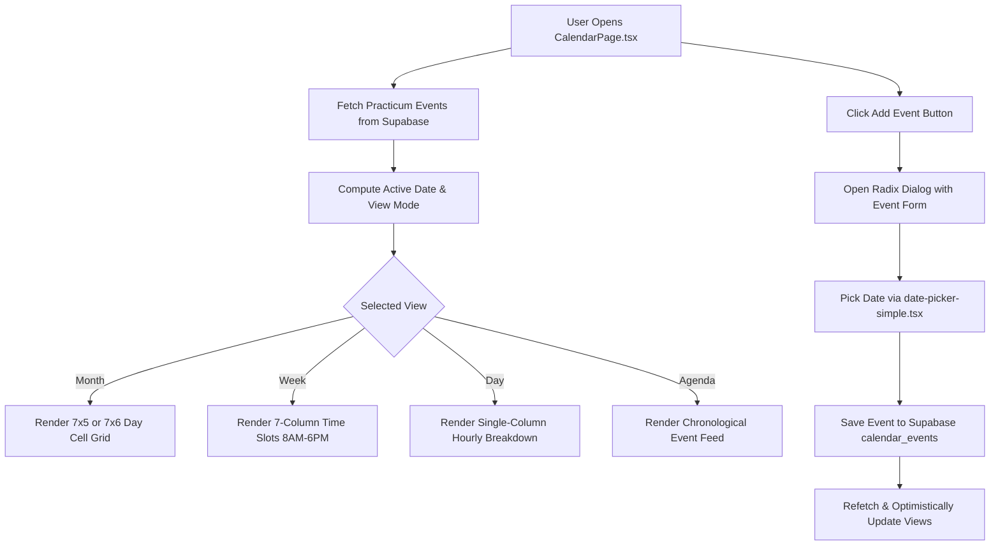

# 📅 Interactive Practicum Calendar & Events Documentation

[← Back to Features Hub](README.md) | [Documentation Hub](../README.md) | [Student Checklist](01_STUDENT_PORTAL_CHECKLIST.md) | [System Map](../architecture/SYSTEM_MAP.md) | [Tasks & Roadmap](../tasks/TASKS.md)

A complete technical breakdown of the **Practicum Calendar & Scheduling System**, multi-view timeline engine, event creation modal, and compact widget integrations.

---

## 🌟 Feature Overview

The Calendar provides students, faculty advisers, and supervisors with a shared scheduling system tailored to practicum milestones:

1. **Four View Modes**: Month view (grid overview), Week view (hourly agenda), Day view (focused schedule), and Agenda view (list of upcoming events).
2. **Comprehensive Event Creator Modal**: Dialog modal equipped with custom date pickers, time selectors, category tagging, and location fields.
3. **Sidebar Mini-Calendar**: Compact interactive widget embedded in dashboard sidebars for quick date navigation.

---

## 🏗️ Architecture & Event Dataflow

---

## 🔍 How It Works Under the Hood

### 1. View Switching Architecture (`CalendarPage.tsx`)

The calendar engine computes days and time slices dynamically using `date-fns`:

- **Month Grid**: Calculates start of week, end of week, and padding days to ensure a consistent 7-column layout with weekend dimming.
- **Event Categories**: Events are color-coded and tagged by type:
  - 🔴 **Deadline**: Requirements cut-offs (e.g. "MOA Submission Deadline")
  - 🔵 **Meeting**: Advising sessions and coordinator check-ins
  - 🟢 **Defense**: Final oral integration paper defense
  - 🟡 **Holiday**: Academic and institutional non-working holidays

---

### 2. Add Event Modal Dialog & Pickers

Clicking the **`+ Add Event`** button opens a Radix `<Dialog>` modal:

- **Title & Description Inputs**: Enforces required title validation.
- **Category Selector**: Dropdown to select event category and visual accent badge.
- **Custom Date Picker (`date-picker-simple.tsx`)**:
  - Clean popover calendar built on `react-day-picker` v10.
  - Formats selected dates as readable strings (e.g. `Sep 2, 2026`).
- **Time Range Selector**: Dual start and end time pickers supporting 12-hour AM/PM formats.
- **Multi-Day Toggle**: Allows scheduling spanning milestones (e.g. "Practicum Orientation Week").

---

### 3. Sidebar Mini-Calendar Widget

In `StudentDashboard.tsx`, the right sidebar hosts a compact mini-calendar:

- Optimized sizing: `size-6` date cells with `h-6.5` rows and `p-3` container padding.
- Visual dots indicating days with active deadlines or required journal submissions.

---

## 🎯 Target Code Locator

| Component / Utility | File Location | Purpose |
| :--- | :--- | :--- |
| **Main Calendar Page** | [`src/pages/shared/CalendarPage.tsx`](../../src/pages/shared/CalendarPage.tsx) | Full calendar component with 4 view modes |
| **Simple Date Picker** | [`components/date-picker-simple.tsx`](../../components/date-picker-simple.tsx) | Popover date selection primitive |
| **Modal Primitive** | [`components/ui/dialog.tsx`](../../components/ui/dialog.tsx) | Radix UI modal wrapper |
| **Mini Sidebar Calendar** | [`src/pages/student/StudentDashboard.tsx`](../../src/pages/student/StudentDashboard.tsx) | Compact sidebar calendar |

---

## 💡 Important Rules & Design Invariants

1. **No External Date Layout Breakage**: Date calculations must use `date-fns` functions (`startOfWeek`, `endOfMonth`, `addDays`) to prevent timezone offset bugs.
2. **Theme-Aware Event Styling**: Event badge colors must use dynamic theme-safe variables (e.g. `bg-primary/10 text-primary border-primary/20`) rather than hardcoded CSS colors.
3. **Keyboard Accessibility**: Modal traps focus and allows closing via the `Escape` key.

---

## Related Documentation & Cross-References

- [01. Student Portal & Checklist](01_STUDENT_PORTAL_CHECKLIST.md) — Practicum milestone tracking
- [System Map & Code Locator](../architecture/SYSTEM_MAP.md) — Navigation routes and shared utilities
- [Active Tasks & Roadmap](../tasks/TASKS.md) — Calendar feature updates and task log
