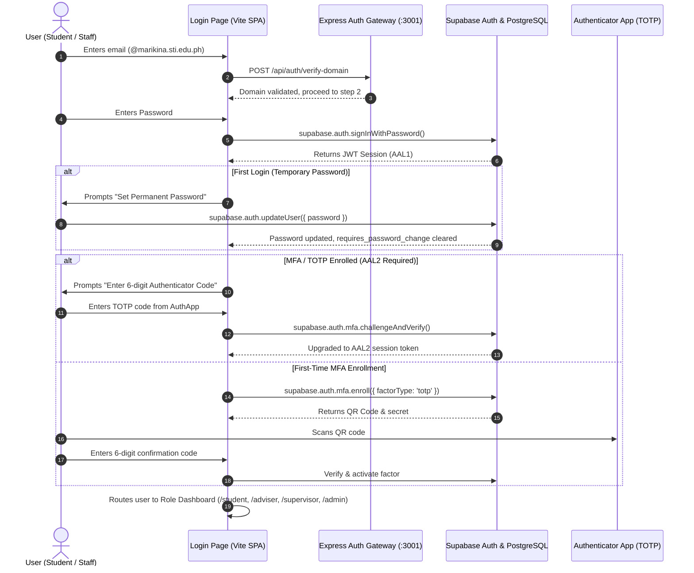

# 🔒 Authentication, Role-Based Access & Security Documentation

[← Back to Features Hub](README.md) | [Documentation Hub](../README.md) | [Backend Architecture](../architecture/BACKEND_AND_DATABASE.md) | [System Map](../architecture/SYSTEM_MAP.md) | [Deployment Guide](../architecture/DEPLOYMENT_AND_VERCEL.md)

A comprehensive technical breakdown of the **Institutional Authentication System**, two-step sign-in, Multi-Factor Authentication (TOTP), Row Level Security (RLS) policies, and administrative account provisioning.

> [!NOTE]
> **Executive Summary**: Zero-trust institutional security. Enforces verified `@marikina.sti.edu.ph` accounts, direct administrative provisioning with unique temporary credentials, mandatory password initialization, Time-based One-Time Password (TOTP) Multi-Factor Authentication (MFA), and granular PostgreSQL Row Level Security (RLS) subqueries.

---

## 🌟 Feature Overview

To ensure data confidentiality, academic integrity, and FERPA/CHED compliance across STI College Marikina practicum records, the platform implements an enterprise security architecture:

1. **Role-Based Single Sign-On Architecture**: Coordinates 4 institutional roles (**Student**, **Adviser**, **Supervisor**, **Administrator**) with role validation enforced on both the backend Express gateway and Supabase PostgreSQL.
2. **Two-Step Sign-In Experience**: Clean Microsoft-style two-step login (`Login.tsx`): identifier entry followed by credential verification, with dynamic tenant validation for `@marikina.sti.edu.ph` domains.
3. **Direct Administrative Account Provisioning**: Administrators directly provision accounts with real institutional email addresses and assigned roles. The server generates a cryptographically random, unique temporary password displayed once to the admin.
4. **Enforced Credential Lifecycle**: New accounts must replace temporary passwords before gaining portal access (`requires_password_change = true`). Password policy requires 6–12 characters with uppercase, lowercase, numbers, and symbols.
5. **Time-Based One-Time Password (TOTP) MFA**: Multi-factor authentication using standard authenticator apps (Google Authenticator, Microsoft Authenticator) with fail-closed enrollment and recovery safeguards.
6. **Row Level Security (RLS) Subquery Isolation**: Every database query and storage request validates user ownership via `(SELECT auth.uid())` subqueries, preventing cross-tenant data leaks.

---

## 🏗️ Authentication & Session Lifecycle Flow



---

## 🛡️ Administrative Account Provisioning & Password Security

### 1. Direct Account Provisioning Workflow
- Accounts are created directly by administrators inside **User Management** (`AdminDashboard.tsx` → `backend/routes/auth.ts`).
- Public self-registration is permanently disabled to maintain strict institutional control over portal access.
- Upon creation, `generateUniquePassword()` generates a high-entropy temporary password conforming to STI institutional complexity rules.
- The temporary password is shown **once** in the admin UI and is never stored in plaintext or sent through unencrypted email.
- The admin securely transmits credentials to the user via verified institutional channels.

### 2. Password Replacement & Policy Rules
- Initial login flags `requires_password_change: true` in `user_profiles`.
- The user cannot access any portal features until a permanent password is set.
- **Complexity Policy**:
  - Minimum length: 6 characters
  - Maximum length: 12 characters
  - Character composition: Must contain uppercase (`[A-Z]`), lowercase (`[a-z]`), numeric (`[0-9]`), and special characters (`[!@#$%^&*...]`).

### 3. Fail-Closed MFA Factor Management
- **Stale Factor Purging**: If a user cancels or interrupts TOTP setup, incomplete/unverified factors are purged before generating a new QR code to prevent duplicate friendly-name collisions.
- **Administrative MFA Reset**: Administrators can reset a compromised or lost MFA factor for another user. The action revokes all active sessions, deletes all enrolled factors, and requires fresh enrollment upon next sign-in.
- **Self-Reset Protection**: An administrator may only trigger self-reset of MFA from a verified `aal2` session.

---

## 🗄️ PostgreSQL Row Level Security (RLS) Architecture

All database queries pass through PostgreSQL Row Level Security. Policies enforce the following invariants:

| Table | Access Level | Policy Enforcement Rule |
| :--- | :--- | :--- |
| `user_profiles` | Authenticated | Students read own profile; advisers/supervisors read assigned students; admins read all. Direct edits restricted to `admin`. |
| `student_documents` | Authenticated | Students read/write their own documents (`owner_id = (SELECT auth.uid())`). Advisers/supervisors read assigned student records. |
| `editor_drafts` | Authenticated | Private to creator (`owner_id = (SELECT auth.uid())`). Never accessible to peers or advisers until submitted. |
| `editor_versions` | Authenticated | Immutable snapshots; read-only access scoped strictly to document owner. |
| `master_templates` | Public Read / Admin Write | All authenticated users can read official templates; upload, update, and deletion restricted to verified administrators. |
| `audit_logs` | Append-Only / Admin Read | Written by server security triggers; readable strictly by administrators for compliance inspection. |

### InitPlan Subquery Optimization
To eliminate per-row authentication evaluation bottlenecks, all RLS policies wrap identity lookups in subqueries:
```sql
-- Optimal: Evaluated once per query execution (InitPlan)
USING (owner_id = (SELECT auth.uid()))

-- Avoided: Evaluated per individual row scan
USING (owner_id = auth.uid())
```

---

## 🎯 Target Code Locator

| Component / Service | File Path | Key Responsibilities |
| :--- | :--- | :--- |
| **Login Component** | [`src/pages/public/Login.tsx`](../../src/pages/public/Login.tsx) | Two-step Microsoft-style authentication, MFA prompt, password setup |
| **Auth Context** | [`src/contexts/AuthContext.tsx`](../../src/contexts/AuthContext.tsx) | Session state, token refresh listener, post-sign-in race guard |
| **Backend Auth Routes** | [`backend/routes/auth.ts`](../../backend/routes/auth.ts) | Admin provisioning, MFA factor removal, password reset, session validation |
| **User Management UI** | [`src/pages/admin/UserManagement.tsx`](../../src/pages/admin/UserManagement.tsx) | User list, role assignment, student-adviser-supervisor binding |
| **Database Migrations** | [`supabase/migrations/04_verified_auth.sql`](../../supabase/migrations/04_verified_auth.sql)<br>[`supabase/migrations/06_direct_account_provisioning.sql`](../../supabase/migrations/06_direct_account_provisioning.sql) | RLS policies, role checks, direct provisioning schema extensions |
| **Auth Test Suite** | [`scripts/auth-security.test.ts`](../../scripts/auth-security.test.ts)<br>[`scripts/auth-database.test.ts`](../../scripts/auth-database.test.ts)<br>[`scripts/auth-render.test.ts`](../../scripts/auth-render.test.ts) | 48 automated tests covering authorization, session checks, and security gates |

---

## 🧪 Verification & Test Suite

Run the full automated authentication and security test suite:
```bash
npm run test:auth
```
- **Tests**: 48/48 passed
- **Coverage**: Anonymous denial, password complexity gates, MFA factor isolation, admin privilege escalation prevention, and temporary password lifecycle.

---

## Related Documentation & Cross-References

- [Backend & Database Architecture](../architecture/BACKEND_AND_DATABASE.md) — PostgreSQL schemas, tables, and storage buckets
- [System Architecture Overview](../architecture/ARCHITECTURE.md) — System boundaries and service topology
- [Deployment & Vercel Guide](../architecture/DEPLOYMENT_AND_VERCEL.md) — Production environment variables and auth origins
- [OneDrive Integration Summary](../architecture/ONEDRIVE_INTEGRATION_SUMMARY.md) — Institutional Microsoft OneDrive cloud archival
