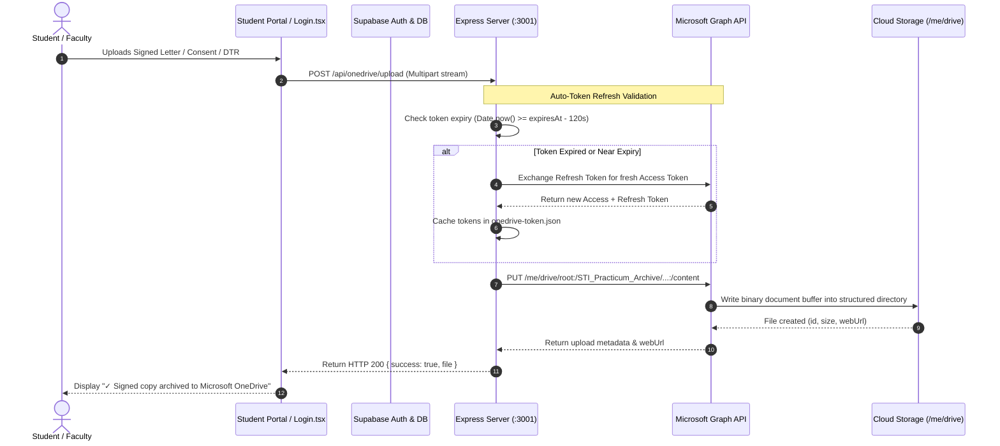

# 🔒 Authentication, OTP Verification & OneDrive Sync Documentation

A technical breakdown of the **Institutional Authentication System**, email-based One-Time Passcode (OTP) verification, and automated Microsoft OneDrive cloud synchronization via Microsoft Graph API.

> 💡 **Executive Summary**: Enterprise security and cloud storage. Enforces institutional @marikina.sti.edu.ph logins, 6-digit OTP verification, and automated Microsoft Graph OneDrive archival with automatic token rotation.

---

## 🌟 Feature Overview

To ensure academic data integrity and compliance with STI College Marikina practicum policies, the system implements an enterprise-grade cloud backup and security infrastructure:

1. **Role-Based Authentication & SSO**: Secure login supporting 4 institutional roles (Student, Adviser, Supervisor, Administrator) with planned Microsoft 365 Single Sign-On (SSO).
2. **Institutional OTP Verification**: 6-digit one-time passcodes delivered directly to `@marikina.sti.edu.ph` inboxes for high-security actions via Microsoft Graph Outlook Mail.
3. **Automated Microsoft OneDrive Archival**: Real-time cloud sync using Microsoft Graph API to archive all signed student submissions, letters, MOAs, and signed DTR spreadsheets into official OneDrive directories.

---

## 🏗️ Architecture & Security Dataflow



---

## 📘 Step-by-Step OneDrive Setup Guide (Never Get Lost)

Follow this complete step-by-step procedure if you ever need to inspect, recreate, or reconfigure the Microsoft connection:

### Step 1: Azure for Students Activation ($0 — No Credit Card Required)

1. Navigate to [**azure.microsoft.com/free/students**](https://azure.microsoft.com/free/students/).
2. Sign in with your official STI student email (`@marikina.sti.edu.ph`).
3. Complete the academic verification form (Country: Philippines, School: STI College Marikina).
4. Click the confirmation link sent to your STI Outlook inbox.
5. This unlocks a full **Microsoft Entra ID (Azure AD)** directory and \$100 cloud credits with **zero credit card or payment information required**.

### Step 2: Multi-Tenant Azure App Registration

1. In [**portal.azure.com**](https://portal.azure.com/), search for **App registrations** and click **+ New registration**.
2. **Name**: `STI-Practicum-Portal`
3. **Supported account types**: Select the 3rd option:
   > *"Accounts in any organizational directory (Any Microsoft Entra ID tenant - Multitenant) and personal Microsoft accounts"*
4. Click **Register**.
5. Copy the **Application (client) ID** and **Directory (tenant) ID** from the Essentials overview box.

### Step 3: Create Client Secret

1. On the left sidebar under *Manage*, click **Certificates & secrets**.
2. Click **+ New client secret**.
3. Description: `practicum-server`.
4. Expires: Select `180 days (6 months)` or `24 months (2 years)`.
5. Click **Add**, and immediately copy the string under the **Value** column *(masked permanently after leaving the page)*.

### Step 4: Grant API Permissions (Microsoft Graph)

1. On the left sidebar, click **API permissions** > **+ Add a permission**.
2. Select **Microsoft Graph** > **Application permissions**.
3. Search for and check: `Files.ReadWrite.All`.
4. Click **Add permissions**, then click **Grant admin consent for [Directory]** so the status displays a green checkmark.

### Step 5: Configure Web Redirect URI

1. On the left sidebar, click **Authentication** > **+ Add a platform** > choose **Web**.
2. Set Redirect URI to:

   ```text
   http://localhost:3001/api/onedrive/auth/callback
   ```

3. Click **Configure** / **Save**.

### Step 6: 1-Click Account Linking

1. Start your local dev server: `npm run dev`.
2. Open an incognito browser window and visit:

   ```text
   http://localhost:3001/api/onedrive/auth/login
   ```

3. Sign in with your personal Microsoft account (bypasses institutional IT consent policies) and click **Accept**.
4. The screen will display: **"OneDrive Connected Successfully!"**.

---

## 🔑 Tokens, Expirations & Lifespans Explained

Understanding the token lifecycle ensures you know exactly when and how the system remains active:

### 1. Access Token (60 to 90 Minutes — Fully Automated)

- **Lifespan**: Access tokens expire every **3,600 seconds (1 hour)** for security.
- **How It Works**: You **never** have to manually refresh this. [`backend/services/onedriveService.ts`](file:///c:/Users/johnd/Downloads/MainCode/backend/services/onedriveService.ts) runs an automatic interceptor:

  ```typescript
  // Checks before every operation; renews 2 minutes before expiration
  if (Date.now() >= token.expiresAt - 120000) {
    return await refreshAccessToken(token.refreshToken);
  }
  ```

  It silently requests a new access token from Microsoft before your upload starts, keeping operations 100% seamless.

### 2. Refresh Token (Rolling 90-Day Window — Indefinite Active Use)

- **Lifespan**: Microsoft OAuth2 refresh tokens feature a **rolling 90-day inactivity timer**.
- **Indefinite Extension**: Every time the backend uses the refresh token to renew an access token, Microsoft extends the rolling window. As long as the portal is used once every 3 months, **it will never expire**.

### 3. Re-Activation Protocol (The 5-Second Fix)

If the project sits completely idle for over 90 days (e.g. during summer vacation) and Microsoft deactivates the session:

- **No Data Loss**: All folders, archives, and files in OneDrive remain **100% permanent and intact**.
- **1-Click Reconnect**: Visit `http://localhost:3001/api/onedrive/auth/login`, click **Accept**, and a brand new refresh token is saved instantly.

### 4. Client Secret Expiration (6 Months to 2 Years)

- **Lifespan**: Selected during creation (180 days to 24 months).
- **Renewal**: When this date arrives, visit **Azure Portal > Certificates & secrets > + New client secret**, copy the new value, and paste it into `.env` under `MICROSOFT_CLIENT_SECRET`.

---

## 📊 Free Storage Quotas & Limits

| Metric | Free Quota | Real-World Practicum Capacity |
| :--- | :--- | :--- |
| **Personal OneDrive Storage** | **5.0 GB** (~5,368,709,120 bytes) | Stores **~25,000 to 50,000** PDF/DOCX letters and Excel DTR sheets (average document is ~100KB to 200KB). |
| **Institutional M365 Storage** | **1.0 TB** (1,000 GB) | Unlimited capacity for tens of thousands of student cohorts. |
| **API Request Rate Limit** | **10,000 requests / 10 minutes** | Allows hundreds of concurrent student submissions without throttling. |
| **Direct Upload File Size** | **4 MB** per single request | Covers 100% of standard practicum letters, consent forms, and DTR spreadsheets. |
| **Upload Session File Size** | Up to **250 GB** | Available for massive video presentations or ZIP archives via upload sessions. |

---

## 📂 Structured Directory Hierarchy on OneDrive

All uploaded files are automatically filed into structured institutional directories:

```text
STI_Practicum_Archive/
└── Practicum_AY_2025_2026/
    └── BSIT_402/
        └── John_Dwayne_B._Guaniso/
            ├── Student_Application_Letter/
            │   └── John_Dwayne_B._Guaniso_Student_Application_Letter_17883581.pdf
            ├── Parent_Consent/
            │   └── John_Dwayne_B._Guaniso_Parent_Consent_17883592.pdf
            ├── Endorsement_Letter/
            │   └── John_Dwayne_B._Guaniso_Endorsement_Letter_17883604.pdf
            ├── MOA_Documents/
            │   └── John_Dwayne_B._Guaniso_MOA_Template_17883610.pdf
            └── Signed_DTR/
                └── DTR_March_2026_Signed.xlsx
```

---

## 🛠️ API Endpoints Reference

The Express backend exposes the following endpoints under `/api`:

| Method | Route | Description |
| :--- | :--- | :--- |
| `GET` | `/api/onedrive/status` | Returns live connection health, account email, drive type, and remaining storage bytes. |
| `GET` | `/api/onedrive/auth/login` | Initiates the Microsoft 365 / OneDrive OAuth2 authorization redirect. |
| `GET` | `/api/onedrive/auth/callback` | Exchanges code for tokens, writes `onedrive-token.json`, and renders success page. |
| `POST` | `/api/onedrive/upload` | Multipart file upload; accepts `folder` query param (e.g. `?folder=AY_2025_2026/BSIT_402/...`). |
| `GET` | `/api/onedrive/files` | Lists drive items inside a designated subfolder. |
| `GET` | `/api/onedrive/file/:id` | Returns metadata and temporary direct download URL for an archived file. |

---

## 🎯 Target Code Locator

| Entity / Logic | File Location | Purpose |
| :--- | :--- | :--- |
| **OneDrive Service** | [`backend/services/onedriveService.ts`](file:///c:/Users/johnd/Downloads/MainCode/backend/services/onedriveService.ts) | Microsoft Graph API client, auto-token refresh, upload engine |
| **OneDrive Routes** | [`backend/routes/onedrive.ts`](file:///c:/Users/johnd/Downloads/MainCode/backend/routes/onedrive.ts) | Express REST endpoints for OAuth, status, and file uploads |
| **Submission Storage** | [`src/lib/submissionStorage.ts`](file:///c:/Users/johnd/Downloads/MainCode/src/lib/submissionStorage.ts) | Triggers automatic OneDrive archive on letter and DTR submissions |
| **Student UI** | [`src/components/compose/StudentDocumentPage.tsx`](file:///c:/Users/johnd/Downloads/MainCode/src/components/compose/StudentDocumentPage.tsx) | Renders upload cards with live OneDrive cloud sync indicator |
| **Server Entry** | [`backend/server.ts`](file:///c:/Users/johnd/Downloads/MainCode/backend/server.ts) | Mounts `/api` routers with Express |

---

## 💡 Important Rules & Design Invariants

1. **Token Security Isolation**: Tokens stored in `backend/config/onedrive-token.json` and `.env` are strictly excluded from git tracking via `.gitignore`.
2. **Offline Fallback**: If network connectivity fails during submission, documents are preserved in IndexedDB / local storage and queued for background synchronization.
3. **Dual Storage Redundancy**: Files are uploaded to Cloudinary for high-speed web browser PDF rendering while simultaneously archiving to Microsoft OneDrive for official compliance and school backups.
