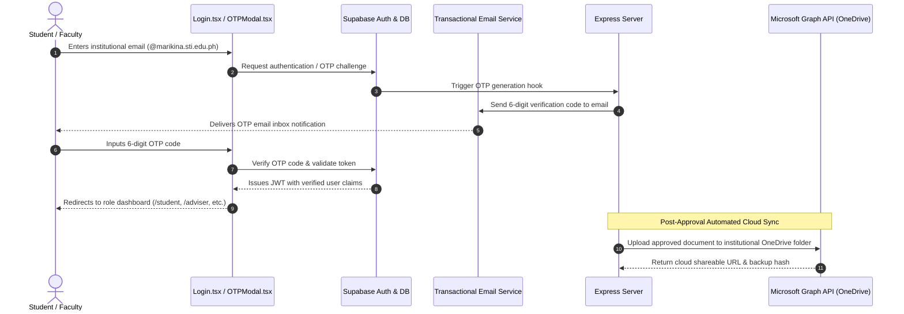

# 🔒 Authentication, OTP Verification & OneDrive Sync Documentation

A technical breakdown of the **Institutional Authentication System**, email-based One-Time Passcode (OTP) verification, and automated Microsoft OneDrive cloud synchronization via Microsoft Graph API.

> 💡 **Executive Summary**: Enterprise security and cloud storage. Enforces institutional @marikina.sti.edu.ph logins, 6-digit OTP verification, and automated Microsoft Graph OneDrive archival.

---

## 🌟 Feature Overview

To ensure academic data integrity and compliance with STI College Marikina policies, the system implements an enterprise-grade security and cloud backup infrastructure:

1. **Role-Based Authentication**: Secure login supporting 4 institutional roles (Student, Adviser, Supervisor, Administrator) with automatic portal routing.
2. **Institutional OTP Verification**: 6-digit one-time passcodes sent directly to `@marikina.sti.edu.ph` institutional emails for high-security actions.
3. **Automated Microsoft OneDrive Archival**: Real-time cloud sync using Microsoft Graph API to archive all approved student submissions, MOAs, and signed DTR spreadsheets into official school OneDrive folders.

---

## 🏗️ Architecture & Security Dataflow



---

## 🔍 How It Works Under the Hood

### 1. Role-Based Access Control & Supabase RLS

Authentication leverages Supabase Auth combined with PostgreSQL Row-Level Security:

* **Protected Role Claims**: Never store user roles in mutable `user_metadata`. Roles are evaluated via protected application claims:

  ```sql
  (SELECT auth.jwt() -> 'app_metadata' ->> 'role')
  ```

* **InitPlan Subquery Caching**: All RLS policies wrap evaluations inside `(SELECT auth.uid())` so Postgres calculates user identity once per query instead of per row scan.

---

### 2. OTP Verification Protocol

* **Domain Restriction**: Only authorized email domains (e.g. `@marikina.sti.edu.ph`) are permitted for student and faculty accounts.
* **Passcode Expiration**: OTP tokens are generated with a strict **10-minute expiration window** and a maximum of 3 invalid attempts before temporary lockout.

---

### 3. Microsoft OneDrive Integration via Graph API

All official practicum documents must be preserved for CHED/DepEd compliance:

* **OAuth2 Server-to-Server Token Rotation**:
  The Express backend uses a Microsoft Graph client configured with tenant credentials. It monitors token validity and refreshes tokens before the 3600-second expiration:

  ```typescript
  if (Date.now() >= tokenExpiresAt - 60000) {
    await refreshMicrosoftGraphToken();
  }
  ```

* **Structured Directory Hierarchy on OneDrive**:
  Files are automatically sorted into structured institutional folders:

  ```text
  STI_OneDrive_Root/
  └── Practicum_AY_2025_2026/
      └── BSIT_Section_4A/
          └── 2021-00123_DelaCruz_Juan/
              ├── Before_OJT/
              │   ├── Student_Application_Letter.docx
              │   └── Notarized_MOA.pdf
              ├── In_OJT/
              │   ├── Signed_DTR_March_2026.xlsx
              │   └── Weekly_Journals_Bundle.pdf
              └── Finals/
                  └── Integration_Paper_Final.pdf
  ```

* **Throttling & Backoff**: Large batch uploads are executed in queues of 3 with exponential backoff on HTTP 429 rate limit responses.

---

## 🎯 Target Code Locator

| Entity / Logic | File Location | Purpose |
| :--- | :--- | :--- |
| **Login Component** | [`src/pages/shared/Login.tsx`](https://github.com/s5condlast-cmd/Capstone-2-Official-CloudHosting/blob/feature/landing-page-fixes/src/pages/shared/Login.tsx) | User credentials and portal redirection |
| **Supabase Client** | [`src/lib/supabase.ts`](https://github.com/s5condlast-cmd/Capstone-2-Official-CloudHosting/blob/feature/landing-page-fixes/src/lib/supabase.ts) | Session management and auth listeners |
| **Backend Auth Routes** | [`backend/routes/auth.ts`](https://github.com/s5condlast-cmd/Capstone-2-Official-CloudHosting/blob/feature/landing-page-fixes/backend/routes/auth.ts) | OTP delivery and verification endpoints |
| **OneDrive Service** | [`backend/services/onedriveService.ts`](https://github.com/s5condlast-cmd/Capstone-2-Official-CloudHosting/blob/feature/landing-page-fixes/backend/services/onedriveService.ts) | Microsoft Graph API cloud sync pipeline |

---

## 💡 Important Rules & Design Invariants

1. **Storage Policy Scoping**: Do not grant blanket public `SELECT` on user submission buckets. Rely on secure signed URLs for student documents.
2. **Search Path Hardening**: All Postgres database triggers must declare `SET search_path = public, pg_temp` and `SECURITY DEFINER` to prevent search path manipulation.
3. **Offline Fallback**: If internet connectivity is interrupted, file uploads queue locally in IndexedDB and synchronize automatically upon reconnection.
