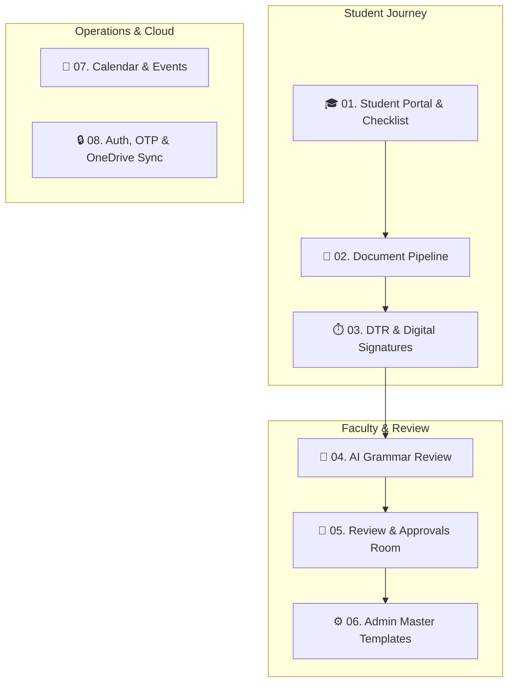

# 🌟 System Features & Functional Documentation Hub

Comprehensive architectural and functional documentation for every core feature in the **Capstone-2 CloudHosting OJT Management System**.

Each feature guide includes detailed visual dataflow diagrams (Mermaid and text), technical explanations of how it operates under the hood, user workflows, and state transitions.

> 💡 **Notion Navigation Tip**: This documentation is optimized for reading on web browsers, Notion, and mobile devices. Click into any feature below to inspect its detailed visual diagrams, code locators, and under-the-hood dataflow.

---

## 🗺️ Feature Architecture Map

---

## 📚 Feature Directory & Documentation Index

### 🎓 1. [Student Portal & Practicum Checklist](01_STUDENT_PORTAL_CHECKLIST.md)

* **What it does**: Guides interns through Before OJT, In OJT, and Finals with dynamic checklists, placement summaries, and completed tasks modal.
* **Key Components**: `StudentDashboard.tsx`, `StudentDocumentPage.tsx`, `dialog.tsx`.
* [Read Complete Feature Guide](01_STUDENT_PORTAL_CHECKLIST.md)

### 📄 2. [Digital Document Generation Pipeline](02_DOCUMENT_PIPELINE.md)

* **What it does**: Converts 13 master STI templates into interactive fill-in-the-blank web forms with DOCX preview and programmatic signature tables.
* **Key Components**: `documentGenerator.ts`, `DocxViewer.tsx`, `AutoWidthInput.tsx`, `easy-template-x`.
* [Read Complete Feature Guide](02_DOCUMENT_PIPELINE.md)

### ⏱️ 3. [DTR Attendance & Signature Fitting](03_DTR_ATTENDANCE_SIGNATURE.md)

* **What it does**: Tracks student daily work hours, calculates totals toward 460 hours, captures digital canvas signatures, and fits signatures into Excel spreadsheets.
* **Key Components**: `DailyTimeRecord.tsx`, `DTRApproval.tsx`, `excelGenerator.ts`, `SignatureCanvas.tsx`.
* [Read Complete Feature Guide](03_DTR_ATTENDANCE_SIGNATURE.md)

### 🤖 4. [AI-Assisted Document & Grammar Review](04_AI_GRAMMAR_AUDIT.md)

* **What it does**: Express serverless endpoint that parses uploaded PDF submissions, checks grammar and compliance via Groq / Gemini, and presents interactive suggestions.
* **Key Components**: `backend/routes/analyze.ts`, `aiService.ts`, `GrammarReviewPanel.tsx`.
* [Read Complete Feature Guide](04_AI_GRAMMAR_AUDIT.md)

### 👥 5. [Adviser & Supervisor Review Rooms](05_ADVISER_SUPERVISOR_REVIEW.md)

* **What it does**: Gives faculty advisers and company supervisors dedicated portals to inspect student submissions, request revisions, and issue official sign-offs.
* **Key Components**: `ReviewDocuments.tsx`, `Approvals.tsx`, `WeeklyJournalReview.tsx`.
* [Read Complete Feature Guide](05_ADVISER_SUPERVISOR_REVIEW.md)

### ⚙️ 6. [Admin Master Templates & Clearance Verification](06_ADMIN_MANAGEMENT.md)

* **What it does**: Master administrative console with uniform 4-button template action grids, student verification queues, user role management, and company partner directory.
* **Key Components**: `TemplateManagement.tsx`, `DocumentVerification.tsx`, `UserManagement.tsx`.
* [Read Complete Feature Guide](06_ADMIN_MANAGEMENT.md)

### 📅 7. [Interactive Practicum Calendar & Events](07_CALENDAR_AND_EVENTS.md)

* **What it does**: Full-featured calendar supporting Month, Week, Day, and Agenda views with dynamic event creation, custom time pickers, and category filters.
* **Key Components**: `CalendarPage.tsx`, `date-picker-simple.tsx`, `Dialog.tsx`.
* [Read Complete Feature Guide](07_CALENDAR_AND_EVENTS.md)

### 🔒 8. [Authentication, OTP Verification & OneDrive Sync](08_AUTH_AND_ONEDRIVE_SYNC.md)

* **What it does**: Secure institutional authentication for STI students and faculty, one-time passcode (OTP) email verification, and automated Microsoft Graph OneDrive cloud backup.
* **Key Components**: `Login.tsx`, `supabase.ts`, `backend/routes/auth.ts`, `onedriveService.ts`.
* [Read Complete Feature Guide](08_AUTH_AND_ONEDRIVE_SYNC.md)
