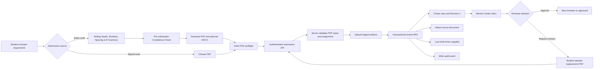

# Implementation Plan

## Student PDF Submission and Iterative Review Workflow

### Goal

Build one end-to-end student submission workflow that accepts a generated or uploaded PDF, routes it to the correct assigned reviewer, creates an immutable revision in the Centralized Review Center, and supports repeated PDF revision cycles without creating unrelated legacy submissions.

The workflow must work from:

- the dedicated `/student/submit` page;
- the Document Editor submit action; and
- an unsubmitted draft card in the Document Repository.

### Decisions to Confirm Before Implementation

1. New review submissions and all later revisions are PDF-only, with a maximum PDF size of 15 MB.
2. Legacy DOCX/XLSX/image submissions remain readable for historical compatibility, but they cannot be used for new review revisions.
3. Editor submissions preserve two artifacts:
   - the generated PDF as the authoritative review revision; and
   - an optional generated DOCX source as an immutable `source_document` case file.
4. A student without every reviewer required by the selected route cannot submit. The UI must explain which assignment is missing and direct the student to an administrator.
5. Requirement routing is authoritative data, not a client choice. Each requirement is configured as either `adviser_only` or `supervisor_then_adviser`.
6. Editor Writing Studio and AI Verification:
   - The Document Editor integrates deterministic line spacing (`1.0`, `1.15`, `1.5`, `2.0`) and paragraph spacing controls, serialized identically into both the generated PDF and source DOCX.
   - Voice dictation (Speech-to-Text) is integrated directly into the editor toolbar using the browser's native Web Speech API (`SpeechRecognition`).
   - In-editor AI Grammar, Spelling, Tone, and Clarity assistance is provided via a dedicated student endpoint (`POST /api/editor/ai-check`) powered by Gemini / Groq.
   - An optional pre-submission compliance audit runs before the final draft lock to warn students of missing required sections, empty signature blocks, or incomplete supervisor fields.

## Non-Negotiable Invariants

- A new, non-legacy `document_revisions` record always points to a validated PDF.
- The server verifies the PDF extension, declared MIME type, `%PDF-` file signature, nonzero size, and 15 MB limit before durable storage.
- Reviewer IDs are derived from the authenticated student's profile. The client never supplies an adviser or supervisor ID.
- Requirement ID determines review route. A client cannot downgrade a supervisor-first requirement to adviser-only.
- A draft submission creates the case, revision, source-file record, audit event, and draft lock in one database transaction.
- Retrying the same request returns the original result rather than creating a duplicate case.
- Every failed operation removes any storage objects created by that attempt.
- A revision can be submitted only while its case is in `adviser_revision_required` or `supervisor_revision_required`.
- Prior revisions and source artifacts remain immutable and accessible to authorized case participants.

## Existing Contracts That Must Be Migrated

The current implementation cannot support the proposed flow without a database migration:

- `profiles.adviser_id` and `profiles.supervisor_id` are text values, while review-case assignment columns are UUIDs.
- `editor_drafts.submission_id` references `student_documents`, not `document_review_cases`.
- `lock_editor_draft_for_submission` accepts only a legacy `student_documents` ID.
- The shared upload policy accepts PDF, DOCX, XLSX, JPG, and PNG at a 10 MB limit.
- `StudentReviewSession` can fall back to creating an unrelated legacy submission.
- Existing review RPCs trust caller-provided MIME metadata and do not enforce PDF bytes.

These are migration requirements, not UI-only changes.

## Architecture and Workflow



## Phase 1: Database and Security Migration

### [NEW] `supabase/migrations/08_student_pdf_submission_workflow.sql`

Create an idempotent migration that performs the following work.

#### 1. Normalize reviewer assignments

- Run a preflight query for nonempty `profiles.adviser_id` and `profiles.supervisor_id` values that are not valid UUIDs. Abort with a descriptive error if invalid data exists.
- Convert both columns to `uuid` using `NULLIF(column, '')::uuid`.
- Add foreign keys to `profiles(id)` with `ON DELETE SET NULL`.
- Update affected RLS policies and functions to compare UUID to UUID without text casts.

#### 2. Add an authoritative requirement catalog

Create `review_requirement_definitions` with at least:

- `id text primary key`;
- `title text not null`;
- `phase text not null` constrained to `before_ojt`, `in_ojt`, or `final`;
- `template_id text`;
- `review_route text not null` constrained to `adviser_only` or `supervisor_then_adviser`;
- `accepts_editor_draft boolean not null default true`;
- `active boolean not null default true`; and
- timestamps.

Seed it from the official institutional requirement list. Grant authenticated users read access; restrict mutation to admins.

#### 3. Link drafts to review cases

Add nullable fields to `editor_drafts`:

- `review_case_id uuid references document_review_cases(id) on delete set null`; and
- `submitted_revision_id uuid references document_revisions(id) on delete set null`.

Keep the legacy `submission_id` temporarily for old rows, but stop writing it for new review submissions. Update repository navigation to prefer `review_case_id`.

#### 4. Add idempotency and PDF constraints

- Add `client_submission_id uuid` to `document_review_cases`.
- Add a unique constraint on `(student_id, client_submission_id)` when `client_submission_id` is not null.
- Require new non-legacy revisions to use `mime_type = 'application/pdf'` and a `.pdf` storage path. Legacy rows with `legacy_student_document_id` remain exempt.
- Extend `document_case_files.purpose` with `source_document` and update the matching TypeScript union.
- Store a SHA-256 checksum for every new primary revision and source document.

#### 5. Replace the initial-submission RPC

Replace or version `create_review_case_from_submission` so it accepts:

- `p_client_submission_id`;
- `p_requirement_id`;
- validated PDF path, filename, byte size, and checksum;
- optional draft ID and expected draft revision; and
- optional source-document path, filename, MIME type, byte size, and checksum.

The RPC must:

1. require an authenticated student;
2. return the existing case when the idempotency key was already committed;
3. load the requirement and derive its review route;
4. load the student's adviser and supervisor assignments;
5. reject missing adviser assignment and reject missing supervisor assignment for supervisor-first requirements;
6. create the review case with assignment IDs derived by the server;
7. create PDF Revision 1 with `source_kind = 'editor'` or `upload`;
8. create the optional `source_document` case-file record;
9. lock the supplied draft only when it belongs to the caller, is still a draft, and matches the expected revision;
10. set the draft's `review_case_id` and `submitted_revision_id`;
11. create the audit event; and
12. return the case ID, revision ID, revision number, and stage.

All database changes above must occur in the RPC's single transaction. Revoke execution of the obsolete signature after all callers are migrated.

#### 6. Harden revision submission

Update `submit_case_revision` to:

- accept checksum metadata;
- require `application/pdf` and a `.pdf` storage path;
- allow submission only from a revision-required stage;
- preserve optimistic concurrency through `p_expected_revision`;
- restart the configured route from the correct first reviewer; and
- remain atomic with its audit event and current-revision update.

## Phase 2: Trusted Submission API

### [NEW] `backend/routes/reviewSubmissions.ts`

Add authenticated multipart endpoints and mount the router in `backend/server.ts` under `/api` and `/`.

#### `POST /api/review-submissions`

Accept:

- required `pdf` file;
- optional `source` DOCX file for editor submissions;
- `clientSubmissionId`;
- `requirementId`;
- optional `draftId` and `expectedDraftRevision`;
- optional student remarks; and
- priority, if priority remains student-configurable.

Processing order:

1. Run `requireIdentity`, `requirePortal`, and `requireRole('student')`.
2. Apply multipart limits: one PDF up to 15 MB and one optional source artifact up to 15 MB.
3. Validate filename extension, MIME type, size, and `%PDF-` magic bytes.
4. Validate the optional source as DOCX by extension, MIME type, and ZIP magic bytes.
5. Calculate SHA-256 checksums.
6. Upload to collision-resistant paths namespaced by authenticated user ID and client submission ID.
7. Call the transactional initial-submission RPC through the authenticated user's Supabase client.
8. Delete both newly uploaded objects if the RPC fails or returns an idempotent result that references different objects.
9. Return only the committed case/revision identifiers and stage.

#### `POST /api/review-cases/:caseId/revisions`

Apply the same trusted PDF checks, upload the file, call `submit_case_revision`, and remove the uploaded object on failure. The route must never fall back to `submissionStorage.uploadSubmission`.

Return `400` for invalid files, `403` for role/assignment/state failures, `409` for stale revisions, and `502` only for storage/provider failures.

#### `POST /api/editor/ai-check`

Provide an authenticated endpoint for student-facing draft assistance and pre-submission compliance audit:

- Accepts: `{ text: string, docType: string, templateId?: string, mode: 'proofread' | 'pre_submit_audit' }`.
- Authentication: `requireIdentity`, `requirePortal`, and `requireRole('student', 'adviser', 'admin')`.
- Functionality:
  - `mode: 'proofread'`: Analyzes draft text for grammar, spelling, sentence flow, and professional tone suited for company HR and formal practicum documentation. Returns structured suggestions (type, original text, replacement, explanation).
  - `mode: 'pre_submit_audit'`: Audits draft text against institutional requirement rules (verifying supervisor details, company name, required reflection sections, and signature blocks) before locking. Returns actionable warnings without hard-blocking emergency submissions.
- Backed by `backend/services/aiService.ts` utilizing Groq with Gemini fallback.

## Phase 3: Shared Client Domain and PDF Generation

### [NEW] `src/config/reviewPdfPolicy.ts`

Create a review-specific policy:

- `.pdf` only;
- `application/pdf` only;
- nonempty file;
- maximum 15 MB; and
- lightweight client magic-byte preflight for early feedback.

Do not narrow `documentUploadPolicy.ts`; it is shared by templates, DTRs, attachments, and legacy screens that still support other formats.

### [NEW] `src/lib/reviewSubmissionService.ts`

Provide typed methods:

- `listActiveRequirements()`;
- `submitInitialReview(input)`; and
- `submitReviewRevision(input)`.

The service must attach the current Supabase access token, use one stable `clientSubmissionId` across retries, parse structured API errors, and never write directly to `student_documents`.

### [NEW] `src/lib/editorReviewArtifacts.ts`

Create one reusable editor export function returning:

```ts
interface EditorReviewArtifacts {
  pdf: File;
  sourceDocx: File;
}
```

The PDF renderer must:

- render the saved editor document envelope, including header/footer settings;
- use A4 dimensions and the editor's print margins;
- apply configured line spacing (`1.0`, `1.15`, `1.5`, `2.0`) and paragraph margins identically to PDF CSS styles and DOCX paragraph formatting;
- wait for `document.fonts.ready` and all document images;
- preserve explicit page breaks, tables, lists, links, and image sizing;
- render from an isolated off-screen print container;
- remove editor-only controls and selection UI; and
- fail visibly rather than uploading a blank or partial PDF.

Use `html2pdf.js` only behind this helper so the submission page and editor cannot diverge. Continue using the existing DOCX serializer for the optional source document, updating it to respect editor line and paragraph spacing.

### [NEW] `src/lib/speechToTextService.ts`

Browser Web Speech API helper for real-time voice dictation in the editor:
- Detects `SpeechRecognition` or `webkitSpeechRecognition` availability with graceful fallback;
- Handles mic permissions, recording state, continuous transcription, and interim transcript callbacks;
- Dispatches clean text segments directly to Plate.js / Slate cursor position.

### [NEW] `src/lib/editorAiService.ts`

Client service connecting to `POST /api/editor/ai-check`:
- `proofreadDraft(text, docType)`: Fetches grammar, spelling, clarity, and tone recommendations;
- `auditCompliance(draft, requirement)`: Runs pre-submission checks against missing supervisor info, empty signatures, and required practicum sections.

## Phase 4: Student Submission UI

### [NEW] `src/pages/student/StudentDocumentSubmission.tsx`

Create a theme-aware submission page with these states:

- requirement loading, empty, and error states;
- assigned adviser and optional supervisor banner;
- explicit missing-assignment blocking state;
- requirement selector grouped by practicum phase;
- source choice between an eligible editor draft and a signed PDF upload;
- selected-draft word count and last-modified metadata;
- selected-file name, size, and validation state;
- optional student remarks;
- progress state for generation, validation, upload, and finalization; and
- recoverable error state that preserves the same idempotency key for retry.

Only unlocked, nondeleted drafts compatible with the chosen requirement may be selected. On success, navigate to `/student/reviews/:caseId`.

Query-string support:

- `/student/submit?draft=<draft-id>` preselects a draft; and
- `/student/submit?requirement=<requirement-id>` preselects a requirement.

Never accept an adviser ID, supervisor ID, or review route from query parameters.

## Phase 5: Existing Entry-Point Integration

### [MODIFY] `src/pages/student/StudentDocumentEditor.tsx`

#### 1. Editor Writing Studio & AI Features
- **Line & Paragraph Spacing**: Add a spacing dropdown to the toolbar (`1.0`, `1.15`, `1.5`, `2.0`) and paragraph margin presets. Store spacing in draft metadata and pass to `editorReviewArtifacts` and `docxSerializer` so exported artifacts are formatted with exact mathematical line-heights.
- **Speech-to-Text Voice Dictation**: Add a `Mic` toolbar button backed by `speechToTextService`. Displays recording status pulse and transcribes live speech directly into the Plate.js cursor position.
- **AI Grammar & Tone Proofreader**: Add an "AI Proofread" toolbar button that queries `POST /api/editor/ai-check`. Renders an interactive side drawer with actionable grammar, spelling, clarity, and corporate tone suggestions.
- **Pre-Submission Compliance Audit**: In `handleSubmit()`, trigger an automated pre-flight audit modal that checks for missing supervisor info, empty signature blocks, and incomplete practicum sections before final submission.

#### 2. Minimal & Non-Destructive UI Design Rules
To preserve the clean aesthetic and avoid disrupting the existing editor workspace:
- **Zero Layout Breakage**: The existing 2-row title and MenuBar (`File Edit View Insert Format Tools`), document return button, word-count telemetry strip, and centered A4 document page envelope remain 100% intact.
- **Top Header Action Cluster**:
  - Place **AI Proofread** directly to the left of `History` in the top-right action bar:
    - Styled identically to existing buttons: `px-3 py-1.5 rounded-xl text-xs sm:text-sm font-semibold border border-border bg-card text-foreground hover:bg-muted/80 shadow-2xs transition-all active:scale-95`.
    - Features a subtle `Sparkles` icon (`size-4 text-amber-500`) and `"Proofread"` label.
  - Place the **Speech-to-Text (Mic)** button either in the formatting toolbar or alongside the header actions:
    - Idle state: Standard ghost button with `Mic` icon (`size-4 text-muted-foreground hover:text-foreground`).
    - Recording state: Subtle breathing pulse with red indicator (`text-rose-500 ring-2 ring-rose-500/30 animate-pulse`), tooltip `"Listening... Click to stop"`.
- **Line Spacing Popover**:
  - Integrated into the editor formatting toolbar as a compact `ArrowUpDown` icon dropdown matching the existing `DropdownMenu` styling (`w-36 bg-card border border-border shadow-xl rounded-xl p-1 z-[150]`).
  - Options: `1.0 (Single)`, `1.15 (Standard)`, `1.5 (Academic)`, `2.0 (Double)`.
- **Docked AI Proofreader Side Panel**:
  - Renders as a collapsible 320px right-hand side panel that sits alongside the A4 page rather than covering the text.
  - Minimalist cards displaying typo corrections, grammar fixes, and polite corporate tone rephrasings with a 1-click `"Apply"` button.
- **Pre-Submission Compliance Dialog**:
  - Kept completely invisible during regular drafting; only triggered when the student clicks `"Submit"`.
  - If 0 issues are found, submission proceeds instantly with zero modal intrusion.
  - If issues are detected, presents a clean `AlertDialog` with concise badges (e.g. `"Empty signature block"`) and two clear options: `"Review Draft"` (secondary) or `"Proceed to Submit"` (primary).

#### 3. Hardened Submission Pipeline
Replace the current DOCX-to-legacy-submission handler with:

1. flush the draft and capture its cloud revision;
2. run optional pre-submission compliance check;
3. generate PDF and source DOCX through `editorReviewArtifacts` with exact spacing styles;
4. submit through `reviewSubmissionService.submitInitialReview`;
5. let the transactional RPC lock and link the draft; and
6. navigate to the returned review case.

The editor must not call `submissionStorage.uploadSubmission` or the legacy draft-lock RPC.

If a requirement must be selected first, navigate to `/student/submit?draft=<draft-id>` instead of silently guessing the document route.

### [MODIFY] `src/pages/student/StudentDocumentRepository.tsx`

- Add a page-header `Submit Document` action linked to `/student/submit`.
- Add `Submit` to each eligible draft card using `/student/submit?draft=<draft-id>`.
- Navigate submitted drafts by `review_case_id`.
- Retain legacy `submission_id` navigation only for pre-migration rows and mark that branch as compatibility code.
- Align table row iconography to institutional open-book asset (`undraw_open-book_pet1.svg`) with direct navigation to linked review cases.

### [MODIFY] `src/pages/student/StudentReviewSession.tsx`

- Replace revision validation with `reviewPdfPolicy`.
- Change the file input to `accept=".pdf,application/pdf"` and update the copy to PDF-only.
- Submit revisions through the trusted API service.
- Remove the fallback that creates a new legacy `student_documents` record when no linked case is found.
- For a legacy document without a case, display a migration/support message rather than starting a disconnected revision chain.

### [MODIFY] `src/components/review/DocumentReviewCenter.tsx`

- Apply the same PDF-only revision input and trusted revision service.
- Display the source document as a separate downloadable case file, never as the primary review canvas.
- Select the preview renderer using revision MIME metadata rather than guessing from signed-URL text.
- Preserve read-only rendering of historical legacy DOCX/XLSX rows.

### [MODIFY] `src/components/review/EmbedPdfWorkspace.tsx`

- Accept explicit `mimeType` and `originalFilename` props.
- Use EmbedPDF only for `application/pdf` revisions.
- Keep legacy viewers isolated behind explicit legacy MIME handling.
- Show a useful error when a signed URL expires or the file cannot be rendered.

## Phase 6: Navigation and Route Wiring

### [MODIFY] `src/App.tsx`

- Import `StudentDocumentSubmission`.
- Add `<Route path="submit" element={<StudentDocumentSubmission />} />` beneath the protected student route.
- Keep `/student/reviews/:id` as the canonical successful-submission destination.

### [MODIFY] `components/app-sidebar.tsx`

Add `Submit Document` at `/student/submit` with an upload/send icon. This is the active sidebar used by `MainLayout`; the unused legacy sidebar should not be edited unless it is separately removed.

## Phase 7: Legacy Compatibility and Rollout

1. Deploy the database migration before the frontend that writes the new review links.
2. Backfill eligible `student_documents` through the existing review-case migration path.
3. Preserve non-PDF legacy revisions with their `legacy_student_document_id`; do not rewrite or pretend they are PDFs.
4. Stop all new student review submissions from writing `student_documents` after the new API is live.
5. Keep compatibility reads until every legacy link has either been backfilled or explicitly archived.
6. Add operational logging for rejected file signatures, missing assignments, cleanup failures, idempotent retries, and RPC conflicts without logging document contents or access tokens.
7. Roll out in staging first, verify storage cleanup and RLS with real role accounts, then deploy the client entry points.

## Verification Plan

### Automated Unit and Contract Tests

Add or update tests covering:

- review PDF policy accepts a valid PDF and rejects renamed files, wrong MIME types, empty files, and files over 15 MB;
- server magic-byte validation rejects a DOCX renamed to `.pdf`;
- requirement route cannot be supplied or downgraded by the client;
- editor artifact generation produces nonempty PDF and DOCX files;
- all revision inputs advertise PDF-only acceptance;
- editor and review screens no longer call `submissionStorage.uploadSubmission` for new submissions or revisions;
- repository links use `review_case_id` for new rows; and
- EmbedPDF receives only PDF revisions.

### Database Integration Tests

Run the migrations against PGlite or a disposable Supabase/Postgres test database and verify:

- valid adviser-only submission;
- valid supervisor-then-adviser submission;
- rejection when adviser assignment is missing;
- rejection when a required supervisor is missing;
- rejection of caller-supplied or cross-user draft IDs;
- one case for repeated requests using the same idempotency key;
- draft lock, case, revision, source file, and audit event commit together;
- transaction rollback leaves none of those rows when draft revision is stale;
- new nonlegacy revisions reject non-PDF metadata;
- resubmission is allowed only from a revision-required stage;
- optimistic concurrency rejects a stale expected revision; and
- RLS limits cases and files to the student, assigned reviewers, and admins.

### API Integration Tests

Verify both submission endpoints for:

- authentication, portal verification, and student role enforcement;
- PDF and source-document size limits;
- byte-signature validation;
- checksum persistence;
- storage cleanup after RPC failure;
- retry behavior after a timed-out successful request; and
- stable `400`, `403`, `409`, and `502` error contracts.

### Browser Workflow Tests

1. Submit an editor draft and verify that the case appears once, the draft is locked, the PDF renders, and the source DOCX is downloadable.
2. Upload a signed PDF and verify correct adviser-only routing.
3. Submit a supervisor-first requirement and verify it first appears only in the assigned supervisor's actionable inbox.
4. Request revisions, upload Revision 2 as PDF, and verify the same case contains both immutable versions.
5. Retry after a simulated network timeout and verify no duplicate case or orphan object is created.
6. Verify missing-assignment messaging and that submission remains disabled.
7. Verify legacy DOCX cases remain viewable but their new revisions require PDF.

### Required Commands

```bash
npm run typecheck
npm run test:auth
npm run test:editor
npm run test:workflow
npm run build
```

The current 30 editor-runtime tests and 15 workflow tests are only the baseline. Workflow assertions that currently approve DOCX/XLSX/image revisions must be updated to distinguish the general upload policy from the new review PDF policy.

## Acceptance Criteria

- Every new review case begins with a server-validated PDF revision.
- Every new revision remains in the same case and prior revisions are unchanged.
- Editor submission locks and links the draft in the same database transaction as case creation.
- Retrying the same submission never creates a duplicate case.
- Missing or invalid reviewer assignments block submission with a clear message.
- Supervisor-first requirements cannot bypass the supervisor.
- Failed submissions leave no database rows or storage objects from the failed attempt.
- The assigned adviser, required supervisor, student, and admins can access the case according to RLS; unrelated users cannot.
- EmbedPDF renders every new primary revision without format conversion.
- The optional editor source document is preserved separately from the review PDF.
- Legacy records remain readable without weakening the PDF-only rule for new submissions.
- Editor line spacing and paragraph margins are preserved identically across editor preview, exported DOCX, and authoritative review PDF.
- Speech-to-text dictation allows hands-free drafting with browser permission handling and clean text insertion.
- The in-editor AI Grammar and Tone assistant provides actionable suggestions without mutating drafts without student consent.
- The pre-submission compliance audit alerts students to missing required fields, signatures, or sections prior to case locking.
